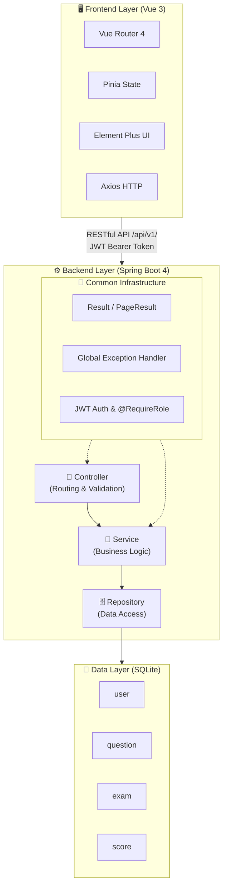
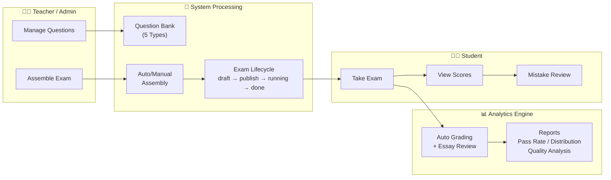

<p align="center">
  
</p>

<h1 align="center">Online Learning System / 在线学习系统</h1>

<p align="center">
  <em>A modern English online learning platform built with Spring Boot 4 and Vue 3</em>
</p>

<p align="center">
  <a href="https://github.com/topics/spring-boot">
    
  </a>
  <a href="https://github.com/topics/vue">
    
  </a>
  <a href="https://www.oracle.com/java/technologies/javase/jdk21-archive-downloads.html">
    
  </a>
  <a href="https://www.sqlite.org/">
    
  </a>
  <a href="LICENSE">
    
  </a>
</p>

***

## Table of Contents

- [Introduction](#-introduction)
- [Features](#-features)
- [Tech Stack](#️-tech-stack)
- [Architecture](#️-architecture)
- [Quick Start](#-quick-start)
- [Project Structure](#-project-structure)
- [Documentation](#-documentation)
- [Contributing & Acknowledgements](#-contributing--acknowledgements)
- [License](#-license)

***

## Introduction

This is an **English Online Learning System** developed as the final project for the *Object-Oriented Software Design & Modeling* course. The system streamlines the entire teaching workflow — from question bank management, exam assembly, online testing, to score analysis — providing a unified platform for students, teachers, and administrators.

In traditional English teaching, instructors face the overhead of maintaining question banks, manually composing exam papers, organizing timed tests, and analyzing student performance. Students, on the other hand, lack convenient tools for online practice and personalized mistake tracking. This system bridges that gap by offering a complete, end-to-end solution.

The system supports **three distinct roles** (Student / Teacher / Admin), each with tailored functionality views and permission boundaries. All data is stored in a structured SQLite database, ensuring historical exams are traceable, question quality is measurable, and performance statistics are actionable.

***

## Features

### Student Portal

- **Online Exam** — Participate in published exams within the designated time window
- **Score Review** — View detailed score breakdowns for each exam attempt
- **Mistake Notebook** — Automatically aggregated wrong questions for targeted review
- **Personal Stats** — Track individual accuracy rates and learning progress

### Teacher Portal

- **Question Bank Management** — Full CRUD for questions across 5 types: Single Choice, Multiple Choice, True/False, Fill-in-the-Blank, Essay
- **Manual Exam Assembly** — Hand-pick questions from the bank and compose custom exams
- **Automatic Exam Assembly** — Configure rules (question count, type filters, usage-based weighting) and let the system randomly draw questions
- **Exam Lifecycle Management** — Publish, withdraw, and delete exams with a 4-state state machine (draft → publish → running → done)
- **Essay Grading** — Manual scoring for subjective questions
- **Multi-dimensional Reports** — Exam pass rates, score distributions, question quality analysis (difficulty identification)

### Admin Portal

- **User Management** — Create, update, enable/disable, and delete users across all roles; batch operations supported
- **Global Dashboard** — System-wide statistics and data overview
- **Full Permissions** — Access to all teacher and student features plus administrative controls

***

## Tech Stack

| Layer                       | Technology                                              | Version                                         |
| --------------------------- | ------------------------------------------------------- | ----------------------------------------------- |
| **Backend Framework**       | Spring Boot                                             | 4.0.6                                           |
| **Language**                | JDK                                                     | 21 (Records, Pattern Matching, Virtual Threads) |
| **ORM**                     | Spring Data JPA + Hibernate                             | Community Dialect 7.2.12.Final                  |
| **Authentication**          | JWT (JSON Web Token)                                    | —                                               |
| **Code Generator**          | Lombok                                                  | —                                               |
| **Database**                | SQLite (xerial JDBC driver)                             | —                                               |
| **Build Tool**              | Maven                                                   | 3.9+                                            |
| **Frontend Framework**      | Vue 3 (Composition API + `<script setup>`)              | —                                               |
| **Frontend Build**          | Vite                                                    | Latest Stable                                   |
| **Frontend Router**         | Vue Router                                              | 4                                               |
| **State Management**        | Pinia                                                   | —                                               |
| **UI Library**              | Element Plus                                            | —                                               |
| **HTTP Client**             | Axios                                                   | —                                               |
| **AI-Assisted Development** | [Trae CN](https://www.trae.ai/) / Qwen3.7 MAX / GLM 5.1 | —                                               |

> The backend is fully implemented and production-ready. The Vue 3 frontend is pending creation.

***

## Architecture

### Overall Design



### Data Flow



### Key Design Patterns

- **Unified Response Contract** — All APIs return `Result<T>` with standardized `{ code, message, data }` format, processed through a global exception handler
- **Entity-DTO Isolation** — JPA entities never leak to the API layer; all responses pass through DTO/VO conversion in the Service layer, preventing JSON circular references and sensitive field exposure
- **Single-Table + JSON Polymorphic Design** — Three strategic JSON fields (`question.answer`, `exam.question_sum`, `score.detail`) enable flexible data structures while keeping the relational schema simple and performant
- **4-Table Independent Architecture** — No JPA `@ManyToOne`/`@OneToMany` relationships; cross-table queries use `findAllById` batch loading, eliminating N+1 query risks entirely
- **Snapshot-Based Exam Assembly** — The `question_sum` JSON field captures a point-in-time snapshot of selected questions, so subsequent question modifications don't retroactively affect existing exams

***

## Quick Start

### Prerequisites

| Requirement | Version  |
| ----------- | -------- |
| JDK         | 21+      |
| Node.js     | 24.15.0+ |
| Maven       | 3.9+     |
| Git         | Latest   |

### Backend

```bash
# 1. Clone the repository
git clone https://github.com/YOUR_USERNAME/GDUT-OOP_20260601.git
cd GDUT-OOP_20260601

# 2. Navigate to backend directory
cd backend

# 3. Run with Maven
mvn spring-boot:run

# 4. Verify: visit http://localhost:8080
#    (Default error page is expected since no root mapping exists)
```

### Run Tests

```bash
cd backend
mvn test
```

Expected output: `Tests run: 73, Failures: 0, Errors: 0, Skipped: 0`

### Frontend (Pending)

```bash
# Frontend is not yet initialized in this repository.
# Planned tech stack: Vue 3 + Vite + Element Plus + Pinia

# Once created:
cd frontend
npm install
npm run dev
```

***

## Project Structure

```
GDUT-OOP_20260601/
├── backend/                          # Spring Boot Backend
│   ├── src/
│   │   ├── main/
│   │   │   ├── java/com/cps/backend/
│   │   │   │   ├── common/           # Shared infrastructure
│   │   │   │   │   ├── api/          # Result<T>, PageResult<T>
│   │   │   │   │   ├── exception/    # BusinessException, GlobalExceptionHandler
│   │   │   │   │   ├── config/       # WebMvcConfig
│   │   │   │   │   └── security/     # JWT utilities & interceptor
│   │   │   │   ├── modules/          # Business modules (vertical slice)
│   │   │   │   │   ├── M01userauth/         # User authentication & management
│   │   │   │   │   ├── M02questionbank/     # Question bank CRUD
│   │   │   │   │   ├── M03examassembly/     # Exam assembly & lifecycle
│   │   │   │   │   └── M04scorestatistics/  # Scoring & statistics
│   │   │   │   └── BackendApplication.java
│   │   │   └── resources/
│   │   │       └── application.yaml  # Production config (PRAGMA, HikariCP, JPA)
│   │   └── test/                     # 73 unit/integration tests (all passing)
│   │       └── resources/
│   │           ├── application-test.yaml
│   │           └── schema/*.sql      # DDL scripts
│   └── pom.xml
├── frontend/                         # Vue 3 Frontend (pending creation)
├── Data/
│   ├── English.sqlite               # SQLite database file
│   └── img/                         # Question images (matched by question ID)
├── scripts/                          # SQL DDL scripts (table_*.sql)
├── wiki/                             # Project documentation
│   ├── 00-INDEX.md                  # Master index & navigation
│   ├── 01-Global-Standards.md       # API contracts, JPA specs, coding standards
│   ├── 02-Data-Dictionary.md        # Database schema & entity mapping
│   ├── modules/                     # Module-level design docs (M01-M04)
│   └── references/                  # Technical references & guides
└── LICENSE
```

***

## Documentation

Detailed technical documentation is available in the `wiki/` directory:

| Document                                                         | Description                                                 |
| ---------------------------------------------------------------- | ----------------------------------------------------------- |
| [00-INDEX.md](wiki/00-INDEX.md)                                  | Master index, project overview, module navigation           |
| [01-Global-Standards.md](wiki/01-Global-Standards.md)            | API contracts, exception handling, JPA specs, code layering |
| [02-Data-Dictionary.md](wiki/02-Data-Dictionary.md)              | Database schema, entity mapping, JSON field specifications  |
| [M01-User-Auth.md](wiki/modules/M01-User-Auth.md)                | User authentication & permission management                 |
| [M02-Question-Bank.md](wiki/modules/M02-Question-Bank.md)        | Question bank CRUD & polymorphic answer JSON                |
| [M03-Exam-Assembly.md](wiki/modules/M03-Exam-Assembly.md)        | Exam lifecycle, manual/automatic assembly strategies        |
| [M04-Score-Statistics.md](wiki/modules/M04-Score-Statistics.md)  | Scoring, grading, statistics & reporting                    |
| [SQLite-Optimization.md](wiki/references/SQLite-Optimization.md) | SQLite-specific tuning & pitfalls in JPA context            |

***

## Contributing & Acknowledgements

### About This Project

This project is the final assignment for the **Object-Oriented Software Design & Modeling** course (*面向对象软件设计与建模*), completed during the junior year second semester at Guangdong University of Technology.

### Acknowledgements

- **AI-Assisted Development**: This project was developed with the assistance of [Trae CN](https://www.trae.ai/) AI Agent, which played a significant role in architecture design, code generation, testing, and documentation.
- **Course Instructors**: Thanks to the course teaching team for providing the requirements specification and design guidelines.

### Contributing

Contributions are welcome! Please feel free to submit an Issue or open a Pull Request. For major changes, please open an issue first to discuss what you would like to change.

1. Fork the repository
2. Create your feature branch (`git checkout -b feature/AmazingFeature`)
3. Commit your changes (`git commit -m 'Add some AmazingFeature'`)
4. Push to the branch (`git push origin feature/AmazingFeature`)
5. Open a Pull Request

***

## License

This project is licensed under the [MIT License](LICENSE).

***

<p align="center">
  Made with ❤️ by the GDUT OOP Team
</p>
