# 文档二：系统设计 编写方案

## 第1章：子系统架构设计

### 1.1 系统架构图

用Mermaid语法展示三层架构 + Common基础设施层：

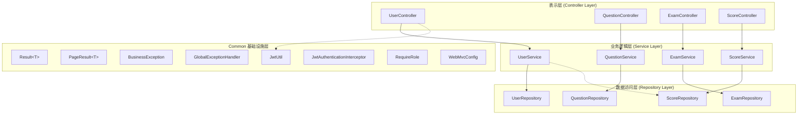
```mermaid
graph TB
    subgraph "表示层 (Controller Layer)"
        UC[UserController]
        QC[QuestionController]
        EC[ExamController]
        SC[ScoreController]
    end

    subgraph "业务逻辑层 (Service Layer)"
        US[UserService]
        QS[QuestionService]
        ES[ExamService]
        SS[ScoreService]
    end

    subgraph "数据访问层 (Repository Layer)"
        UR[UserRepository]
        QR[QuestionRepository]
        ER[ExamRepository]
        SR[ScoreRepository]
    end

    subgraph "Common 基础设施层"
        RT[Result&lt;T&gt;]
        PR[PageResult&lt;T&gt;]
        BE[BusinessException]
        GEH[GlobalExceptionHandler]
        JU[JwtUtil]
        JAI[JwtAuthenticationInterceptor]
        RR[RequireRole]
        WMC[WebMvcConfig]
    end

    UC --> US
    QC --> QS
    EC --> ES
    SC --> SS

    US --> UR
    QS --> QR
    ES --> ER
    SS --> SR

    US -.-> SR
    UC -.-> JU
```

架构说明：
- **表示层（Controller Layer）**：接收HTTP请求，参数校验，调用Service，返回统一Result<T>响应。4个Controller对应4个业务模块。
- **业务逻辑层（Service Layer）**：核心业务逻辑，事务控制，Entity↔DTO转换，跨Repository协调。4个Service实现各模块业务规则。
- **数据访问层（Repository Layer）**：继承JpaRepository，提供基础CRUD + 自定义查询方法。4个Repository对应4张核心表。
- **Common基础设施层**：横切关注点，包括统一响应封装、全局异常处理、JWT认证与权限控制、Web配置。

### 1.2 类包图

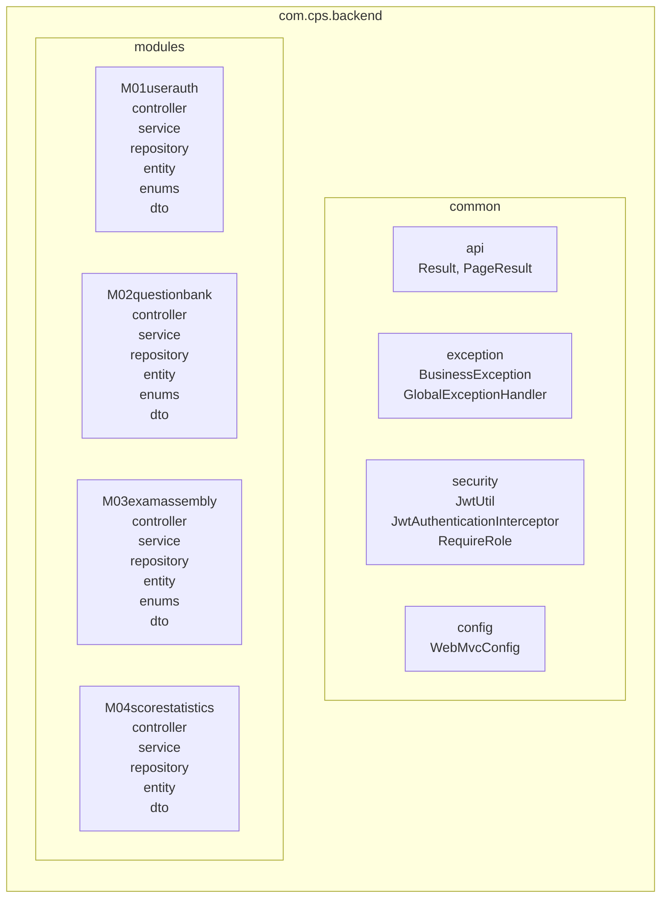
```mermaid
graph LR
    subgraph "com.cps.backend"
        subgraph "common"
            api[api<br/>Result, PageResult]
            exception[exception<br/>BusinessException<br/>GlobalExceptionHandler]
            security[security<br/>JwtUtil<br/>JwtAuthenticationInterceptor<br/>RequireRole]
            config[config<br/>WebMvcConfig]
        end
        subgraph "modules"
            M01[M01userauth<br/>controller<br/>service<br/>repository<br/>entity<br/>enums<br/>dto]
            M02[M02questionbank<br/>controller<br/>service<br/>repository<br/>entity<br/>enums<br/>dto]
            M03[M03examassembly<br/>controller<br/>service<br/>repository<br/>entity<br/>enums<br/>dto]
            M04[M04scorestatistics<br/>controller<br/>service<br/>repository<br/>entity<br/>dto]
        end
    end
```

### 数据来源
- 项目目录结构：backend/src/main/java/com/cps/backend/
- wiki/01-Global-Standards.md §6 代码分层标准

### 预估篇幅：2页图 + 1000字说明

---

## 第2章：每一层的类文件结构

### 2.1 Controller层

| 类名 | 所属模块 | 方法列表 |
|---|---|---|
| UserController | M01 | login(), register(), logout(), getCurrentUser(), changePassword(), listUsers(), createUser(), updateUser(), updateUserStatus(), deleteUser(), batchDeleteUsers() |
| QuestionController | M02 | getRandomQuestion(), createQuestion(), batchImportQuestions(), getQuestionById(), listQuestions(), updateQuestion(), deleteQuestion(), batchDeleteQuestions() |
| ExamController | M03 | createManualExam(), createAutoExam(), listAvailableExams(), getExamById(), getExamForStudent(), updateExam(), publishExam(), withdrawExam(), deleteExam(), listExams() |
| ScoreController | M04 | submitExam(), gradeEssay(), getMyScores(), getMyMistakes(), getScoreById(), getExamScores(), getExamStatistics(), getQuestionStatistics(), getQuestionStatisticById() |

### 2.2 Service层

| 类名 | 所属模块 | 核心方法签名 |
|---|---|---|
| UserService | M01 | register(RegisterReq): UserVO, login(LoginReq): LoginResp, getCurrentUser(Integer): UserVO, changePassword(Integer, ChangePasswordReq): void, listUsers(Integer, Integer, UserType, Integer): PageResult\<UserVO\>, createUser(RegisterReq): UserVO, updateUser(Integer, RegisterReq): UserVO, updateUserStatus(Integer, UserStatusReq): void, deleteUser(Integer, Integer): void, batchDeleteUsers(List\<Integer\>, Integer): void |
| QuestionService | M02 | create(QuestionCreateReq): QuestionVO, batchCreate(List\<QuestionCreateReq\>): BatchImportResult, findById(Integer): QuestionVO, search(QuestionQueryReq): Page\<QuestionVO\>, update(Integer, QuestionUpdateReq): QuestionVO, delete(Integer): void, getRandomQuestion(QuestionType, List\<Integer\>): QuestionPreviewVO |
| ExamService | M03 | createManualExam(ExamCreateManualReq): ExamVO, createAutoExam(ExamCreateAutoReq): ExamVO, listAvailableExams(): List\<ExamForStudentVO\>, getExamById(Integer): ExamVO, getExamForStudent(Integer): ExamForStudentVO, updateExam(Integer, ExamCreateManualReq): ExamVO, publishExam(Integer): void, withdrawExam(Integer): void, deleteExam(Integer): void, listExams(Integer, Integer, ExamStatus): PageResult\<ExamVO\> |
| ScoreService | M04 | submitExam(ExamSubmitReq, Integer): ScoreVO, gradeEssay(Integer, EssayGradeReq): ScoreVO, getMyScores(Integer, Integer, Integer): PageResult\<ScoreListVO\>, getMyMistakes(Integer, Integer, Integer): PageResult\<MistakeItemVO\>, findById(Integer): ScoreVO, getExamScores(Integer, Integer, Integer): PageResult\<ScoreListVO\>, getExamStatistics(Integer): ExamStatisticsVO, getQuestionStatisticsPaginated(Integer, Integer, String): PageResult\<QuestionStatisticsVO\>, getQuestionStatisticById(Integer): QuestionStatisticsVO |

### 2.3 Repository层

| 接口名 | 所属模块 | 自定义查询方法 |
|---|---|---|
| UserRepository | M01 | findByName(String): Optional\<User\>, existsByName(String): boolean, findByTypeAndStatus(UserType, Integer): List\<User\>, findByType(UserType): List\<User\> |
| QuestionRepository | M02 | findByType(QuestionType): List\<Question\>, searchByKeyword(String, Pageable): Page\<Question\>, incrementUse(Integer): void, incrementCorrect(Integer): void, findRandomByType(QuestionType, List\<Integer\>): Optional\<Question\> |
| ExamRepository | M03 | findByStatus(ExamStatus): List\<Exam\>, findByTimeWindow(String, String): List\<Exam\>, findByStatusNot(ExamStatus, Pageable): Page\<Exam\> |
| ScoreRepository | M04 | findByUserAndExam(Integer, Integer): Optional\<Score\>, findByUser(Integer): List\<Score\>, findByExam(Integer, Pageable): Page\<Score\>, upsertScore(Integer, Integer, Integer, String): void |

### 2.4 Entity层

| 类名 | 字段 |
|---|---|
| User | id(Integer), name(String), password(String), type(UserType), status(Integer) |
| Question | id(Integer), type(QuestionType), context(String), img(Integer), answer(String/JSON), use(Integer), correct(Integer) |
| Exam | id(Integer), exam(String), status(ExamStatus), starttime(String), endtime(String), questionSum(String/JSON) |
| Score | id(Integer), user(Integer/FK), exam(Integer/FK), all(Integer), detail(String/JSON) |

### 2.5 DTO层

**M01 DTO（7个）**：
- LoginReq(name, password)
- LoginResp(token, userVO)
- RegisterReq(name, password, type)
- ChangePasswordReq(oldPassword, newPassword)
- UserStatusReq(status)
- BatchDeleteReq(ids)
- UserVO(id, name, type, status)

**M02 DTO（10个）**：
- QuestionCreateReq(type, context, img, answer)
- QuestionUpdateReq(context, img, answer)
- QuestionQueryReq(type, keyword, page, size)
- QuestionVO(id, type, context, img, answer, use, correct, accuracy)
- QuestionPreviewVO(id, type, context, img)
- BatchImportResult(successCount, failCount, errors)
- Answer(interface), SingleChoiceAnswer, MultipleChoiceAnswer, JudgeAnswer, FillAnswer, EssayAnswer

**M03 DTO（10个）**：
- ExamCreateManualReq(exam, starttime, endtime, items)
- ExamCreateAutoReq(exam, starttime, endtime, rule)
- AutoRule(typeFilter, totalQuestions, totalScore, usePenalty)
- ExamQuestionItemReq(questionId, score)
- ExamVO(id, exam, status, starttime, endtime, questions, totalQuestions, totalScore)
- ExamQuestionVO(questionId, type, score)
- ExamForStudentVO(id, exam, starttime, endtime, questions)
- ExamQuestionForStudentVO(questionId, type, context, imgPath, imgUrl, options, score)
- QuestionSum(version, items, totalQuestions, totalScore)
- QuestionSumItem(questionId, type, score)

**M04 DTO（13个）**：
- ExamSubmitReq(examId, answers)
- AnswerItem(questionId, userAnswer)
- EssayGradeReq(items)
- ScoreVO(id, user, userName, exam, examName, all, maxScore, accuracy, detail)
- ScoreListVO(id, examName, all, maxScore, accuracy)
- ScoreDetail(version, items, summary)
- DetailItem(questionId, userAnswer, correctAnswer, score, isCorrect)
- Summary(correctCount, totalCount, accuracy)
- MistakeItemVO(questionId, type, context, userAnswer, correctAnswer)
- ExamStatisticsVO(examId, examName, participantCount, averageScore, maxScore, minScore, passRate)
- QuestionStatisticsVO(questionId, type, context, useCount, correctCount, accuracy)
- DetailItemVO(questionId, type, context, userAnswer, correctAnswer, score, isCorrect)
- UserExamHistoryVO(examName, all, accuracy, submitTime)

### 2.6 Common层

| 类名 | 职责 |
|---|---|
| Result\<T\> | 统一API响应封装，含code/message/data，提供success()/error()静态方法 |
| PageResult\<T\> | 分页响应封装，含content/totalElements/totalPages/page/size，提供of()转换方法 |
| BusinessException | 业务异常类，含code/message，继承RuntimeException |
| GlobalExceptionHandler | 全局异常处理器，@RestControllerAdvice，处理BusinessException/MethodArgumentNotValidException/Exception |
| JwtUtil | JWT工具类，提供generateToken()/parseToken()/validateToken()/getUserId()/getName()/getType() |
| JwtAuthenticationInterceptor | JWT认证拦截器，preHandle()验证Token，检查@RequireRole权限 |
| RequireRole | 自定义注解，标记方法所需角色权限 |
| WebMvcConfig | WebMvc配置，注册拦截器+静态资源映射 |

### 数据来源
- 项目代码文件

### 预估篇幅：2000字

---

## 第3章：每个用例的详细时序图（VOPC类图）

VOPC（View Of Participating Classes）类图展示每个用例涉及的参与类及其方法调用关系。以下为38个用例的VOPC类图草案：

### M01 VOPC类图（11个）

#### UC-M01-01 用户登录 VOPC
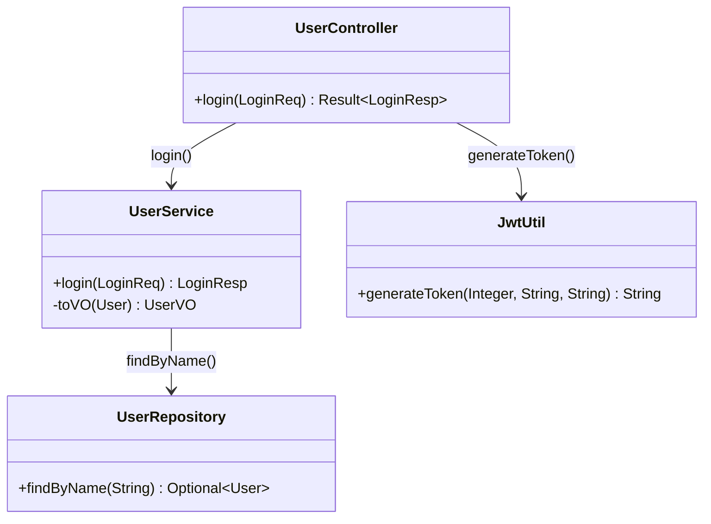
```mermaid
classDiagram
    class UserController {
        +login(LoginReq) Result~LoginResp~
    }
    class UserService {
        +login(LoginReq) LoginResp
        -toVO(User) UserVO
    }
    class UserRepository {
        +findByName(String) Optional~User~
    }
    class JwtUtil {
        +generateToken(Integer, String, String) String
    }
    UserController --> UserService : login()
    UserService --> UserRepository : findByName()
    UserController --> JwtUtil : generateToken()
```

#### UC-M01-02 用户注册 VOPC
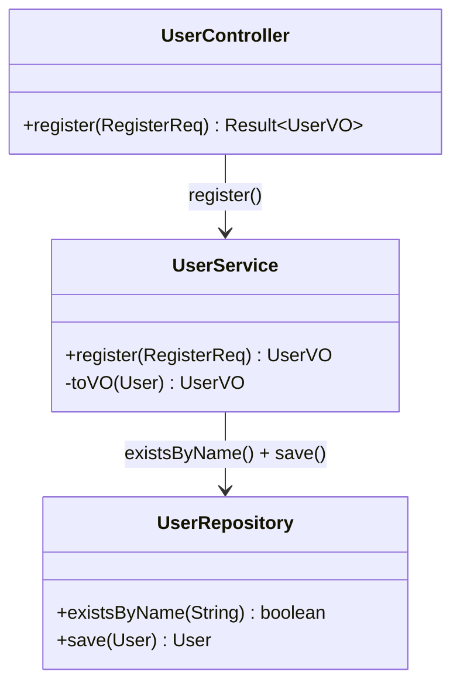
```mermaid
classDiagram
    class UserController {
        +register(RegisterReq) Result~UserVO~
    }
    class UserService {
        +register(RegisterReq) UserVO
        -toVO(User) UserVO
    }
    class UserRepository {
        +existsByName(String) boolean
        +save(User) User
    }
    UserController --> UserService : register()
    UserService --> UserRepository : existsByName() + save()
```

#### UC-M01-03 用户登出 VOPC
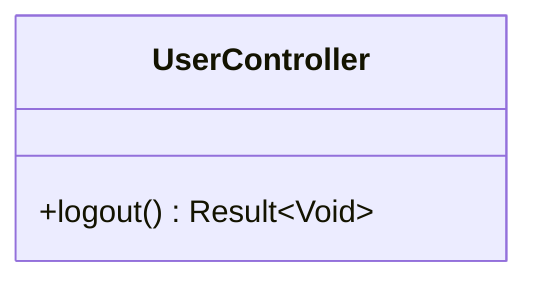
```mermaid
classDiagram
    class UserController {
        +logout() Result~Void~
    }
```

#### UC-M01-04 获取当前用户信息 VOPC
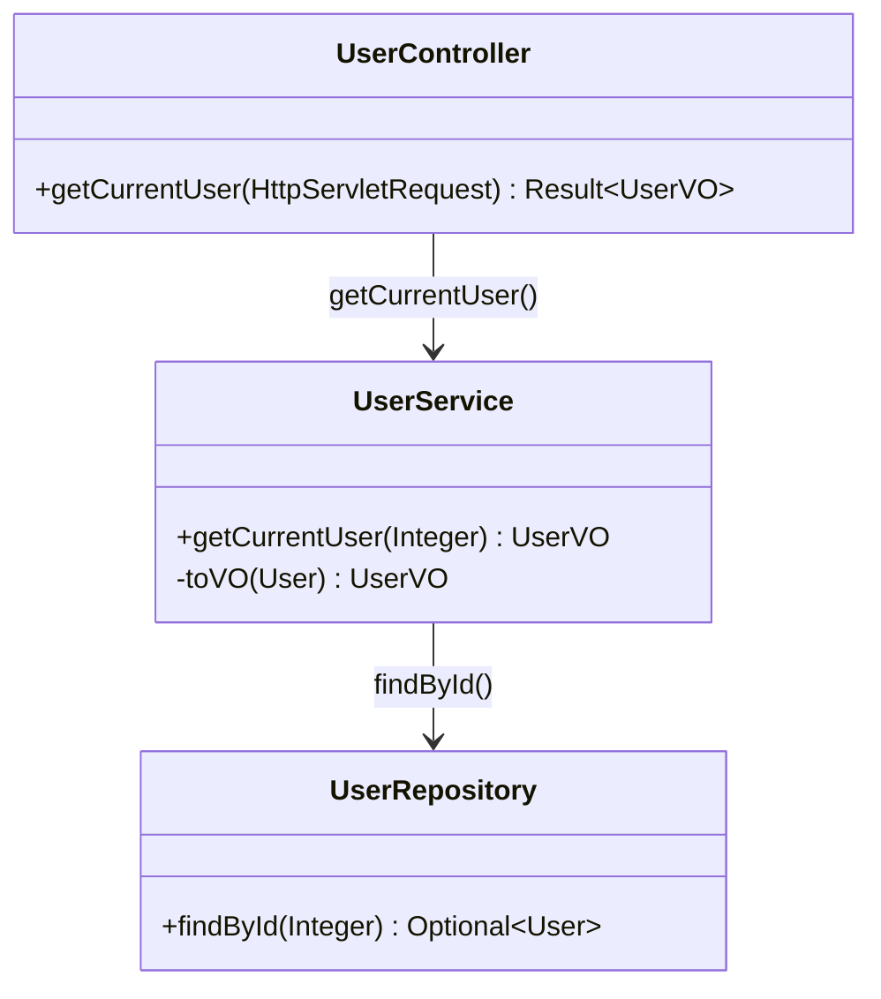
```mermaid
classDiagram
    class UserController {
        +getCurrentUser(HttpServletRequest) Result~UserVO~
    }
    class UserService {
        +getCurrentUser(Integer) UserVO
        -toVO(User) UserVO
    }
    class UserRepository {
        +findById(Integer) Optional~User~
    }
    UserController --> UserService : getCurrentUser()
    UserService --> UserRepository : findById()
```

#### UC-M01-05 修改密码 VOPC
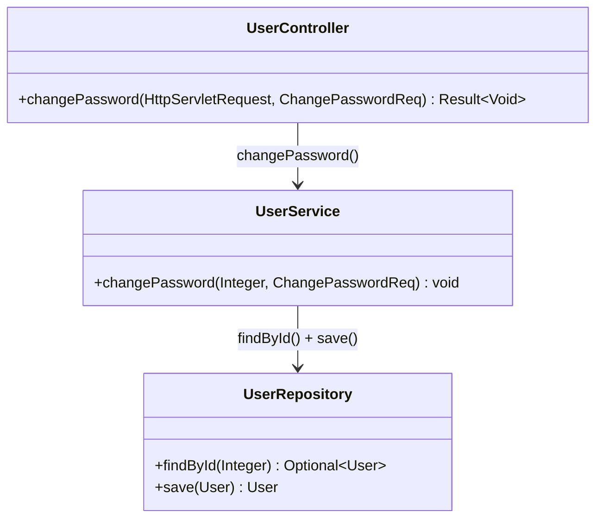
```mermaid
classDiagram
    class UserController {
        +changePassword(HttpServletRequest, ChangePasswordReq) Result~Void~
    }
    class UserService {
        +changePassword(Integer, ChangePasswordReq) void
    }
    class UserRepository {
        +findById(Integer) Optional~User~
        +save(User) User
    }
    UserController --> UserService : changePassword()
    UserService --> UserRepository : findById() + save()
```

#### UC-M01-06 分页查询用户列表 VOPC
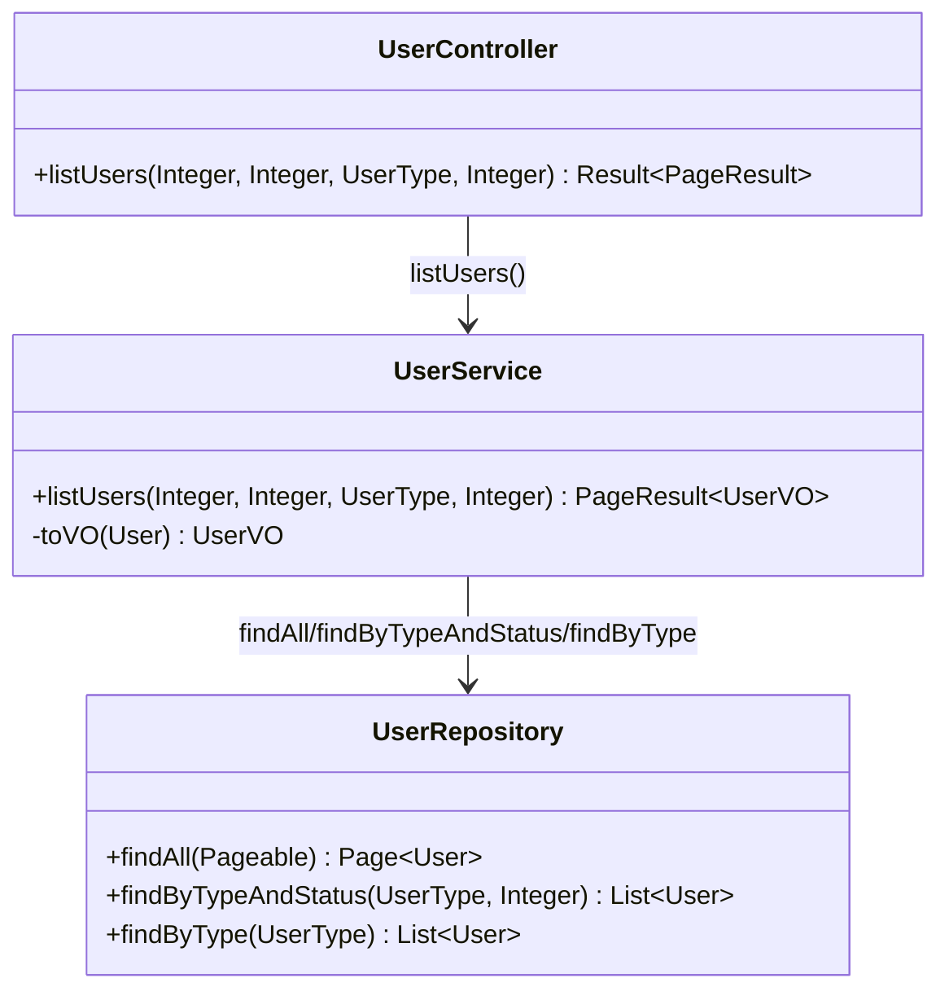
```mermaid
classDiagram
    class UserController {
        +listUsers(Integer, Integer, UserType, Integer) Result~PageResult~
    }
    class UserService {
        +listUsers(Integer, Integer, UserType, Integer) PageResult~UserVO~
        -toVO(User) UserVO
    }
    class UserRepository {
        +findAll(Pageable) Page~User~
        +findByTypeAndStatus(UserType, Integer) List~User~
        +findByType(UserType) List~User~
    }
    UserController --> UserService : listUsers()
    UserService --> UserRepository : findAll/findByTypeAndStatus/findByType
```

#### UC-M01-07 创建用户 VOPC
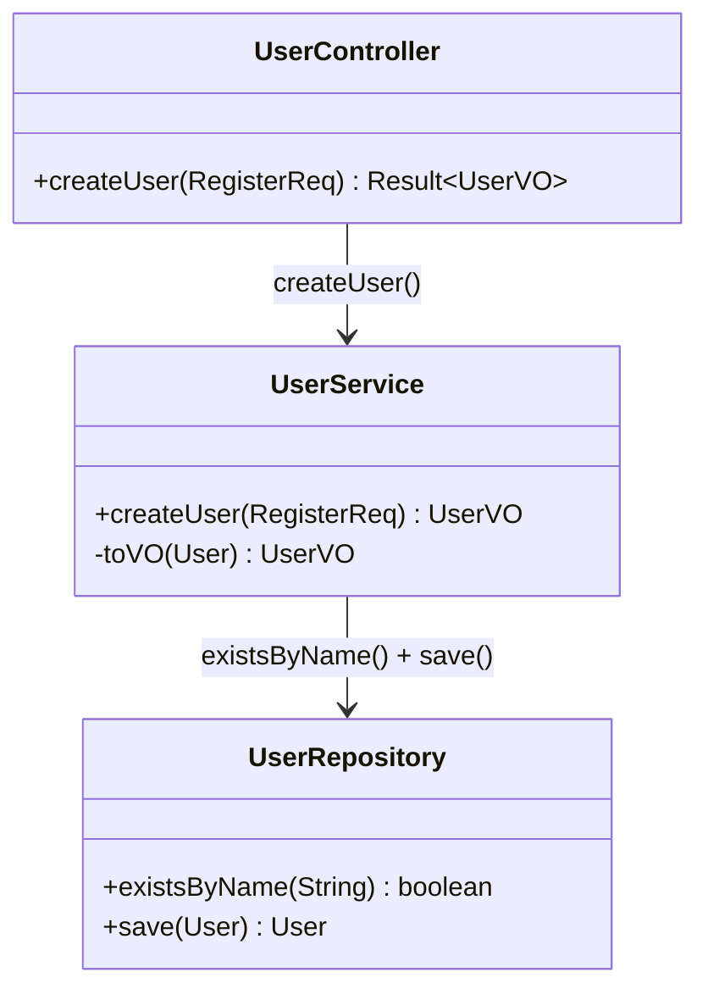
```mermaid
classDiagram
    class UserController {
        +createUser(RegisterReq) Result~UserVO~
    }
    class UserService {
        +createUser(RegisterReq) UserVO
        -toVO(User) UserVO
    }
    class UserRepository {
        +existsByName(String) boolean
        +save(User) User
    }
    UserController --> UserService : createUser()
    UserService --> UserRepository : existsByName() + save()
```

#### UC-M01-08 更新用户 VOPC
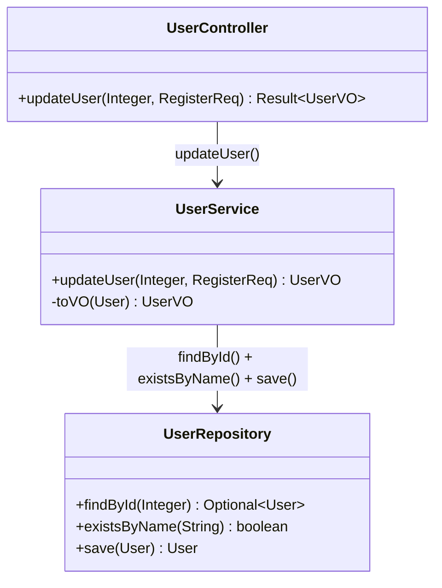
```mermaid
classDiagram
    class UserController {
        +updateUser(Integer, RegisterReq) Result~UserVO~
    }
    class UserService {
        +updateUser(Integer, RegisterReq) UserVO
        -toVO(User) UserVO
    }
    class UserRepository {
        +findById(Integer) Optional~User~
        +existsByName(String) boolean
        +save(User) User
    }
    UserController --> UserService : updateUser()
    UserService --> UserRepository : findById() + existsByName() + save()
```

#### UC-M01-09 更新用户状态 VOPC
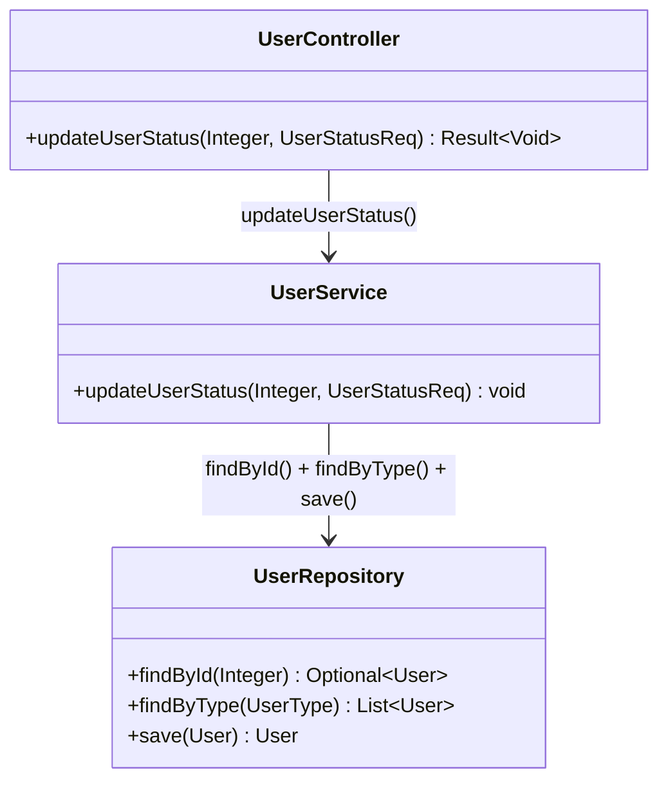
```mermaid
classDiagram
    class UserController {
        +updateUserStatus(Integer, UserStatusReq) Result~Void~
    }
    class UserService {
        +updateUserStatus(Integer, UserStatusReq) void
    }
    class UserRepository {
        +findById(Integer) Optional~User~
        +findByType(UserType) List~User~
        +save(User) User
    }
    UserController --> UserService : updateUserStatus()
    UserService --> UserRepository : findById() + findByType() + save()
```

#### UC-M01-10 删除用户 VOPC
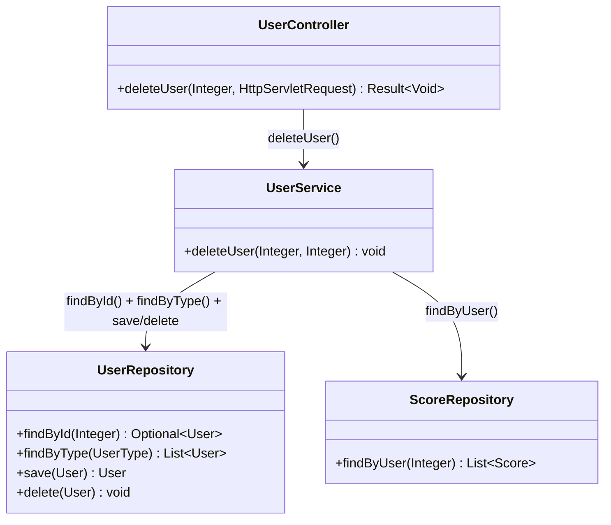
```mermaid
classDiagram
    class UserController {
        +deleteUser(Integer, HttpServletRequest) Result~Void~
    }
    class UserService {
        +deleteUser(Integer, Integer) void
    }
    class UserRepository {
        +findById(Integer) Optional~User~
        +findByType(UserType) List~User~
        +save(User) User
        +delete(User) void
    }
    class ScoreRepository {
        +findByUser(Integer) List~Score~
    }
    UserController --> UserService : deleteUser()
    UserService --> UserRepository : findById() + findByType() + save/delete
    UserService --> ScoreRepository : findByUser()
```

#### UC-M01-11 批量删除用户 VOPC
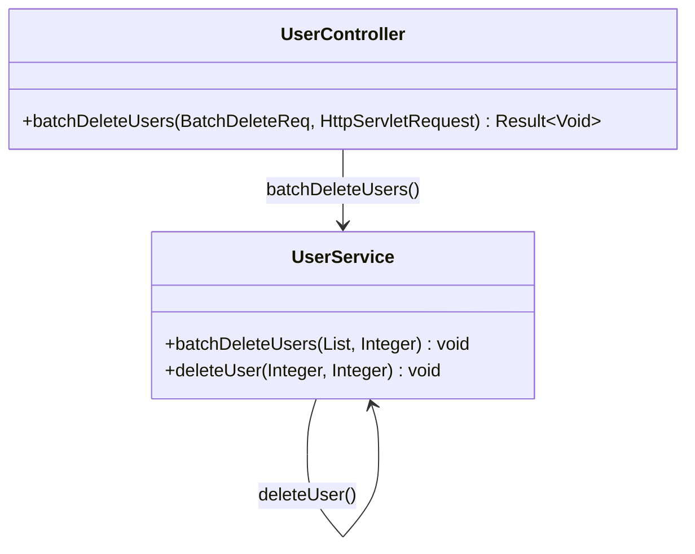
```mermaid
classDiagram
    class UserController {
        +batchDeleteUsers(BatchDeleteReq, HttpServletRequest) Result~Void~
    }
    class UserService {
        +batchDeleteUsers(List, Integer) void
        +deleteUser(Integer, Integer) void
    }
    UserController --> UserService : batchDeleteUsers()
    UserService --> UserService : deleteUser()
```

### M02 VOPC类图（8个）

#### UC-M02-01 创建题目 VOPC
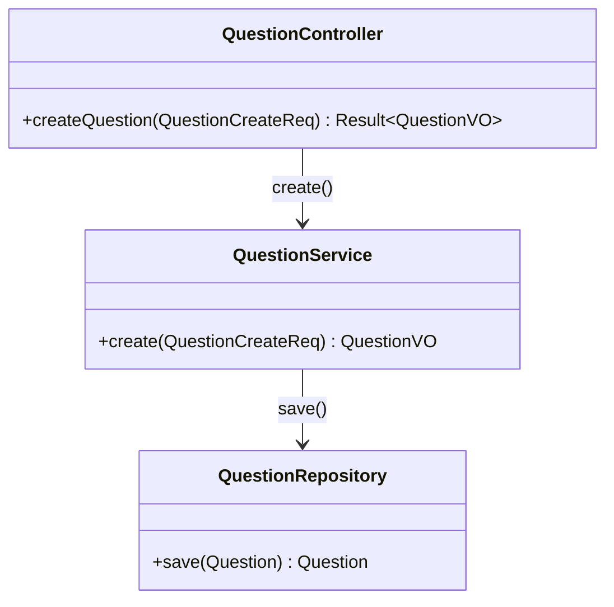
```mermaid
classDiagram
    class QuestionController {
        +createQuestion(QuestionCreateReq) Result~QuestionVO~
    }
    class QuestionService {
        +create(QuestionCreateReq) QuestionVO
    }
    class QuestionRepository {
        +save(Question) Question
    }
    QuestionController --> QuestionService : create()
    QuestionService --> QuestionRepository : save()
```

#### UC-M02-02 批量导入题目 VOPC
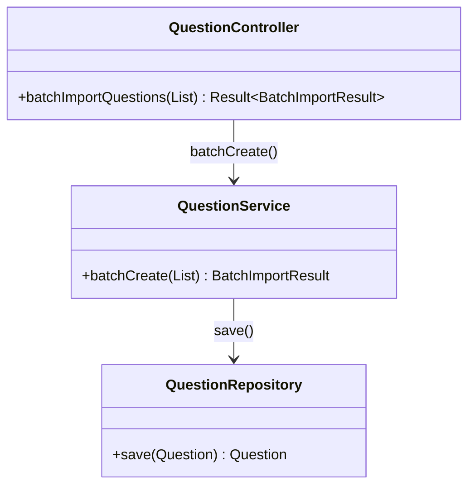
```mermaid
classDiagram
    class QuestionController {
        +batchImportQuestions(List) Result~BatchImportResult~
    }
    class QuestionService {
        +batchCreate(List) BatchImportResult
    }
    class QuestionRepository {
        +save(Question) Question
    }
    QuestionController --> QuestionService : batchCreate()
    QuestionService --> QuestionRepository : save()
```

#### UC-M02-03 查询题目详情 VOPC
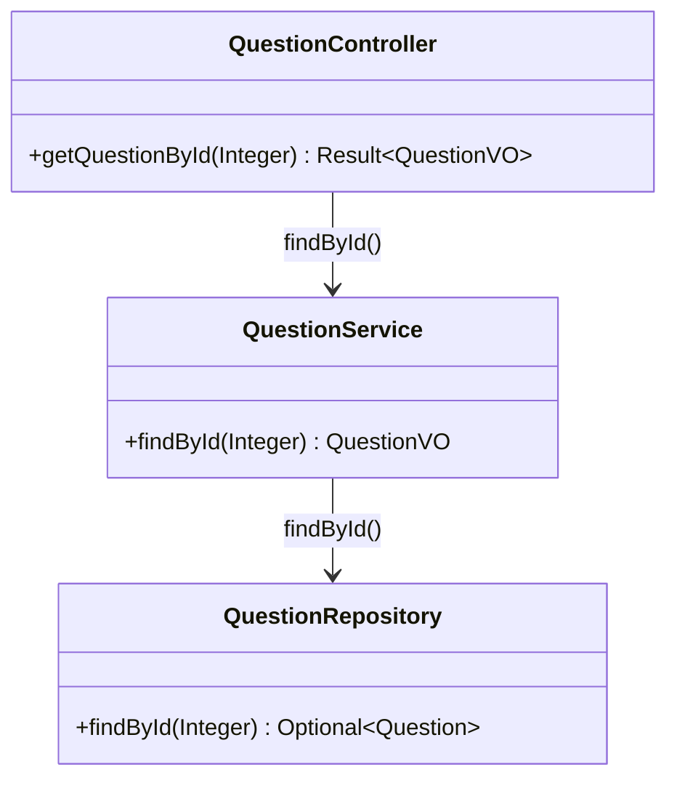
```mermaid
classDiagram
    class QuestionController {
        +getQuestionById(Integer) Result~QuestionVO~
    }
    class QuestionService {
        +findById(Integer) QuestionVO
    }
    class QuestionRepository {
        +findById(Integer) Optional~Question~
    }
    QuestionController --> QuestionService : findById()
    QuestionService --> QuestionRepository : findById()
```

#### UC-M02-04 分页查询题目列表 VOPC
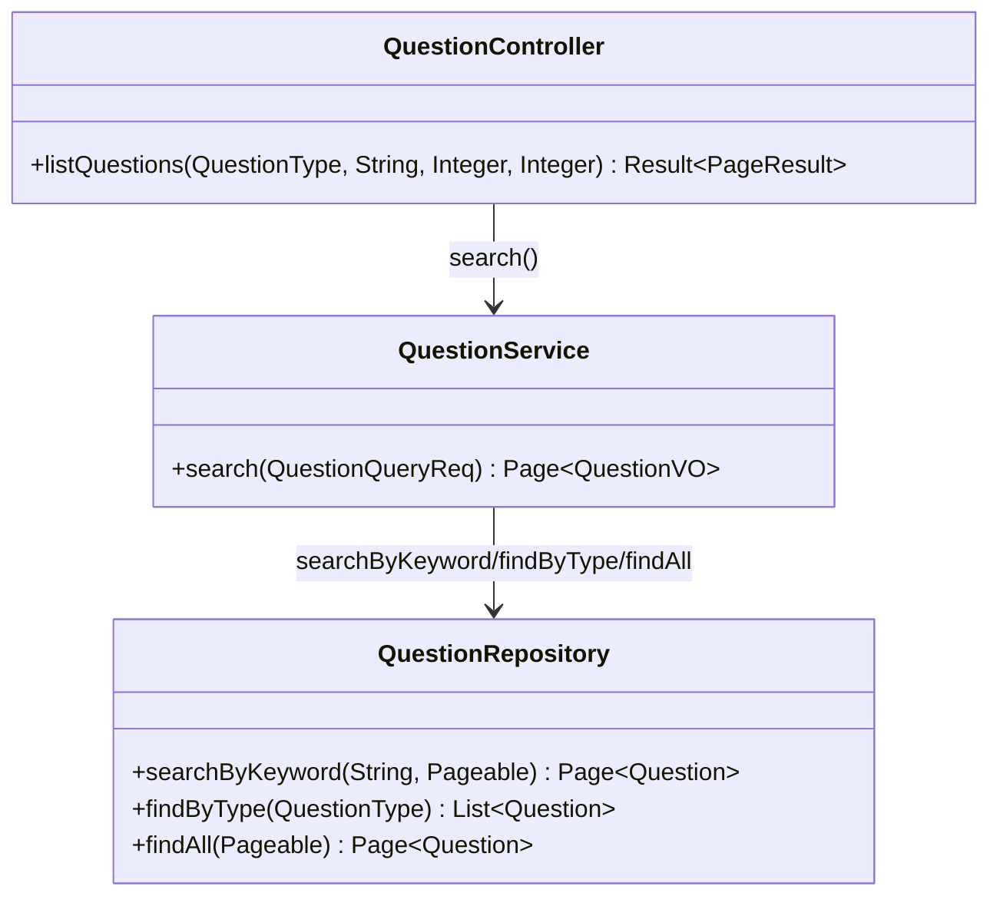
```mermaid
classDiagram
    class QuestionController {
        +listQuestions(QuestionType, String, Integer, Integer) Result~PageResult~
    }
    class QuestionService {
        +search(QuestionQueryReq) Page~QuestionVO~
    }
    class QuestionRepository {
        +searchByKeyword(String, Pageable) Page~Question~
        +findByType(QuestionType) List~Question~
        +findAll(Pageable) Page~Question~
    }
    QuestionController --> QuestionService : search()
    QuestionService --> QuestionRepository : searchByKeyword/findByType/findAll
```

#### UC-M02-05 更新题目 VOPC
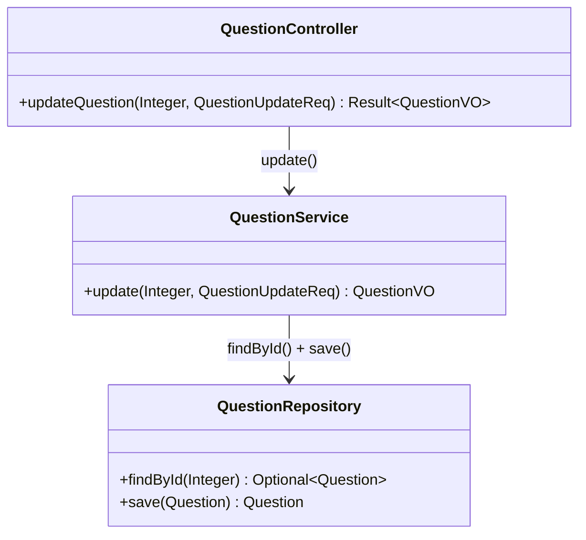
```mermaid
classDiagram
    class QuestionController {
        +updateQuestion(Integer, QuestionUpdateReq) Result~QuestionVO~
    }
    class QuestionService {
        +update(Integer, QuestionUpdateReq) QuestionVO
    }
    class QuestionRepository {
        +findById(Integer) Optional~Question~
        +save(Question) Question
    }
    QuestionController --> QuestionService : update()
    QuestionService --> QuestionRepository : findById() + save()
```

#### UC-M02-06 删除题目 VOPC
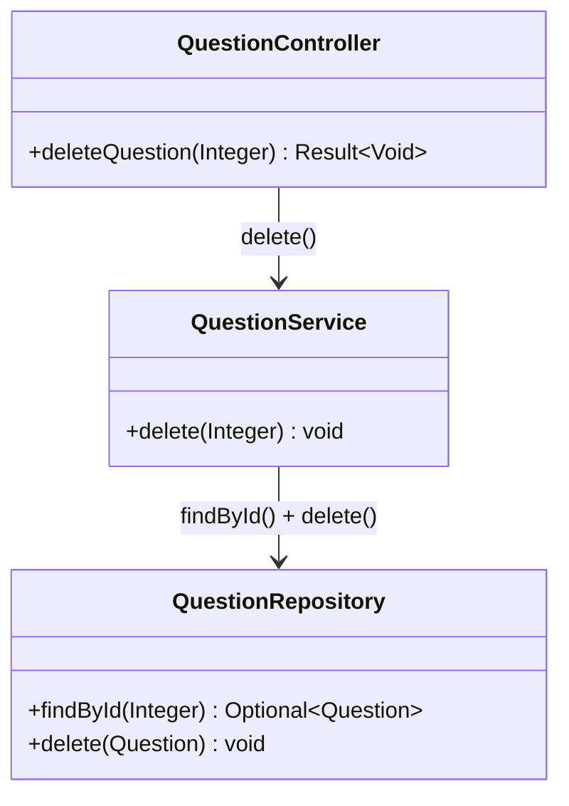
```mermaid
classDiagram
    class QuestionController {
        +deleteQuestion(Integer) Result~Void~
    }
    class QuestionService {
        +delete(Integer) void
    }
    class QuestionRepository {
        +findById(Integer) Optional~Question~
        +delete(Question) void
    }
    QuestionController --> QuestionService : delete()
    QuestionService --> QuestionRepository : findById() + delete()
```

#### UC-M02-07 批量删除题目 VOPC
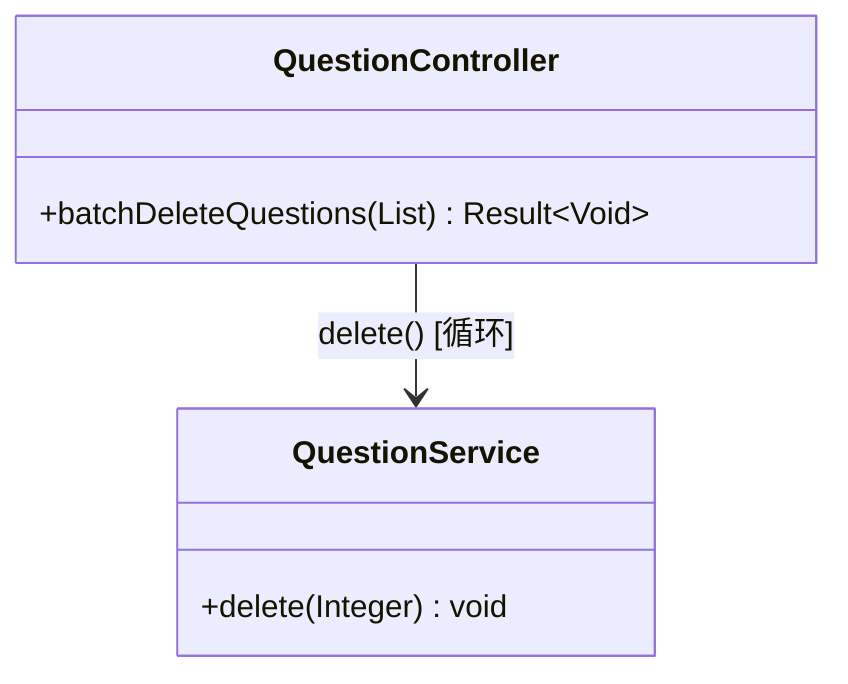
```mermaid
classDiagram
    class QuestionController {
        +batchDeleteQuestions(List) Result~Void~
    }
    class QuestionService {
        +delete(Integer) void
    }
    QuestionController --> QuestionService : delete() [循环]
```

#### UC-M02-08 随机获取题目 VOPC
```mermaid
classDiagram
    class QuestionController {
        +getRandomQuestion(QuestionType, List) Result~QuestionPreviewVO~
    }
    class QuestionService {
        +getRandomQuestion(QuestionType, List) QuestionPreviewVO
    }
    class QuestionRepository {
        +findRandomByType(QuestionType, List) Optional~Question~
    }
    QuestionController --> QuestionService : getRandomQuestion()
    QuestionService --> QuestionRepository : findRandomByType()
```

### M03 VOPC类图（10个）

#### UC-M03-01 创建手动组卷考试 VOPC
```mermaid
classDiagram
    class ExamController {
        +createManualExam(ExamCreateManualReq) Result~ExamVO~
    }
    class ExamService {
        +createManualExam(ExamCreateManualReq) ExamVO
    }
    class ExamRepository {
        +save(Exam) Exam
    }
    class QuestionRepository {
        +findById(Integer) Optional~Question~
        +incrementUse(Integer) void
    }
    ExamController --> ExamService : createManualExam()
    ExamService --> QuestionRepository : findById() + incrementUse()
    ExamService --> ExamRepository : save()
```

#### UC-M03-02 创建自动组卷考试 VOPC
```mermaid
classDiagram
    class ExamController {
        +createAutoExam(ExamCreateAutoReq) Result~ExamVO~
    }
    class ExamService {
        +createAutoExam(ExamCreateAutoReq) ExamVO
    }
    class ExamRepository {
        +save(Exam) Exam
    }
    class QuestionRepository {
        +findByType(QuestionType) List~Question~
        +incrementUse(Integer) void
    }
    ExamController --> ExamService : createAutoExam()
    ExamService --> QuestionRepository : findByType() + incrementUse()
    ExamService --> ExamRepository : save()
```

#### UC-M03-03 获取可参加考试列表 VOPC
```mermaid
classDiagram
    class ExamController {
        +listAvailableExams() Result~List~
    }
    class ExamService {
        +listAvailableExams() List~ExamForStudentVO~
    }
    class ExamRepository {
        +findByStatus(ExamStatus) List~Exam~
    }
    ExamController --> ExamService : listAvailableExams()
    ExamService --> ExamRepository : findByStatus()
```

#### UC-M03-04 获取考试详情 VOPC
```mermaid
classDiagram
    class ExamController {
        +getExamById(Integer) Result~ExamVO~
    }
    class ExamService {
        +getExamById(Integer) ExamVO
    }
    class ExamRepository {
        +findById(Integer) Optional~Exam~
    }
    ExamController --> ExamService : getExamById()
    ExamService --> ExamRepository : findById()
```

#### UC-M03-05 学生预览考试 VOPC
```mermaid
classDiagram
    class ExamController {
        +getExamForStudent(Integer) Result~ExamForStudentVO~
    }
    class ExamService {
        +getExamForStudent(Integer) ExamForStudentVO
    }
    class ExamRepository {
        +findById(Integer) Optional~Exam~
    }
    ExamController --> ExamService : getExamForStudent()
    ExamService --> ExamRepository : findById()
```

#### UC-M03-06 修改考试 VOPC
```mermaid
classDiagram
    class ExamController {
        +updateExam(Integer, ExamCreateManualReq) Result~ExamVO~
    }
    class ExamService {
        +updateExam(Integer, ExamCreateManualReq) ExamVO
    }
    class ExamRepository {
        +findById(Integer) Optional~Exam~
        +save(Exam) Exam
    }
    ExamController --> ExamService : updateExam()
    ExamService --> ExamRepository : findById() + save()
```

#### UC-M03-07 发布考试 VOPC
```mermaid
classDiagram
    class ExamController {
        +publishExam(Integer) Result~Void~
    }
    class ExamService {
        +publishExam(Integer) void
    }
    class ExamRepository {
        +findById(Integer) Optional~Exam~
        +save(Exam) Exam
    }
    ExamController --> ExamService : publishExam()
    ExamService --> ExamRepository : findById() + save()
```

#### UC-M03-08 撤回考试 VOPC
```mermaid
classDiagram
    class ExamController {
        +withdrawExam(Integer) Result~Void~
    }
    class ExamService {
        +withdrawExam(Integer) void
    }
    class ExamRepository {
        +findById(Integer) Optional~Exam~
        +save(Exam) Exam
    }
    ExamController --> ExamService : withdrawExam()
    ExamService --> ExamRepository : findById() + save()
```

#### UC-M03-09 删除考试 VOPC
```mermaid
classDiagram
    class ExamController {
        +deleteExam(Integer) Result~Void~
    }
    class ExamService {
        +deleteExam(Integer) void
    }
    class ExamRepository {
        +findById(Integer) Optional~Exam~
        +delete(Exam) void
    }
    ExamController --> ExamService : deleteExam()
    ExamService --> ExamRepository : findById() + delete()
```

#### UC-M03-10 分页查询考试列表 VOPC
```mermaid
classDiagram
    class ExamController {
        +listExams(ExamStatus, Integer, Integer) Result~PageResult~
    }
    class ExamService {
        +listExams(Integer, Integer, ExamStatus) PageResult~ExamVO~
    }
    class ExamRepository {
        +findByStatusNot(ExamStatus, Pageable) Page~Exam~
    }
    ExamController --> ExamService : listExams()
    ExamService --> ExamRepository : findByStatusNot()
```

### M04 VOPC类图（9个）

#### UC-M04-01 提交答卷 VOPC
```mermaid
classDiagram
    class ScoreController {
        +submitExam(Integer, ExamSubmitReq, HttpServletRequest) Result~ScoreVO~
    }
    class ScoreService {
        +submitExam(ExamSubmitReq, Integer) ScoreVO
    }
    class ScoreRepository {
        +upsertScore(Integer, Integer, Integer, String) void
    }
    class ExamRepository {
        +findById(Integer) Optional~Exam~
    }
    class QuestionRepository {
        +findById(Integer) Optional~Question~
        +incrementCorrect(Integer) void
    }
    ScoreController --> ScoreService : submitExam()
    ScoreService --> ExamRepository : findById()
    ScoreService --> QuestionRepository : findById() + incrementCorrect()
    ScoreService --> ScoreRepository : upsertScore()
```

#### UC-M04-02 教师评卷 VOPC
```mermaid
classDiagram
    class ScoreController {
        +gradeEssay(Integer, EssayGradeReq) Result~ScoreVO~
    }
    class ScoreService {
        +gradeEssay(Integer, EssayGradeReq) ScoreVO
    }
    class ScoreRepository {
        +findById(Integer) Optional~Score~
        +save(Score) Score
    }
    class QuestionRepository {
        +incrementCorrect(Integer) void
    }
    ScoreController --> ScoreService : gradeEssay()
    ScoreService --> ScoreRepository : findById() + save()
    ScoreService --> QuestionRepository : incrementCorrect()
```

#### UC-M04-03 查询我的成绩 VOPC
```mermaid
classDiagram
    class ScoreController {
        +getMyScores(HttpServletRequest, Integer, Integer) Result~PageResult~
    }
    class ScoreService {
        +getMyScores(Integer, Integer, Integer) PageResult~ScoreListVO~
    }
    class ScoreRepository {
        +findByUser(Integer, Pageable) Page~Score~
    }
    ScoreController --> ScoreService : getMyScores()
    ScoreService --> ScoreRepository : findByUser()
```

#### UC-M04-04 查询我的错题集 VOPC
```mermaid
classDiagram
    class ScoreController {
        +getMyMistakes(HttpServletRequest, Integer, Integer) Result~PageResult~
    }
    class ScoreService {
        +getMyMistakes(Integer, Integer, Integer) PageResult~MistakeItemVO~
    }
    class ScoreRepository {
        +findByUser(Integer) List~Score~
    }
    ScoreController --> ScoreService : getMyMistakes()
    ScoreService --> ScoreRepository : findByUser()
```

#### UC-M04-05 查询分数详情 VOPC
```mermaid
classDiagram
    class ScoreController {
        +getScoreById(Integer) Result~ScoreVO~
    }
    class ScoreService {
        +findById(Integer) ScoreVO
    }
    class ScoreRepository {
        +findById(Integer) Optional~Score~
    }
    ScoreController --> ScoreService : findById()
    ScoreService --> ScoreRepository : findById()
```

#### UC-M04-06 查询考试所有考生分数 VOPC
```mermaid
classDiagram
    class ScoreController {
        +getExamScores(Integer, Integer, Integer) Result~PageResult~
    }
    class ScoreService {
        +getExamScores(Integer, Integer, Integer) PageResult~ScoreListVO~
    }
    class ScoreRepository {
        +findByExam(Integer, Pageable) Page~Score~
    }
    ScoreController --> ScoreService : getExamScores()
    ScoreService --> ScoreRepository : findByExam()
```

#### UC-M04-07 考试统计报表 VOPC
```mermaid
classDiagram
    class ScoreController {
        +getExamStatistics(Integer) Result~ExamStatisticsVO~
    }
    class ScoreService {
        +getExamStatistics(Integer) ExamStatisticsVO
    }
    class ScoreRepository {
        +findByExam(Integer) List~Score~
    }
    class ExamRepository {
        +findById(Integer) Optional~Exam~
    }
    ScoreController --> ScoreService : getExamStatistics()
    ScoreService --> ExamRepository : findById()
    ScoreService --> ScoreRepository : findByExam()
```

#### UC-M04-08 题目统计列表 VOPC
```mermaid
classDiagram
    class ScoreController {
        +getQuestionStatistics(Integer, Integer, String) Result~PageResult~
    }
    class ScoreService {
        +getQuestionStatisticsPaginated(Integer, Integer, String) PageResult~QuestionStatisticsVO~
    }
    class QuestionRepository {
        +findAll(Pageable) Page~Question~
    }
    ScoreController --> ScoreService : getQuestionStatisticsPaginated()
    ScoreService --> QuestionRepository : findAll()
```

#### UC-M04-09 单题详细统计 VOPC
```mermaid
classDiagram
    class ScoreController {
        +getQuestionStatisticById(Integer) Result~QuestionStatisticsVO~
    }
    class ScoreService {
        +getQuestionStatisticById(Integer) QuestionStatisticsVO
    }
    class QuestionRepository {
        +findById(Integer) Optional~Question~
    }
    ScoreController --> ScoreService : getQuestionStatisticById()
    ScoreService --> QuestionRepository : findById()
```

### 数据来源
- Service层方法实现代码

### 预估篇幅：38张VOPC类图

---

## 第4章：核心类的详细定义

### 4.1 UserService

```mermaid
classDiagram
    class UserService {
        -UserRepository userRepository
        -ScoreRepository scoreRepository
        -BCryptPasswordEncoder passwordEncoder
        +register(RegisterReq) UserVO
        +login(LoginReq) LoginResp
        +getCurrentUser(Integer) UserVO
        +changePassword(Integer, ChangePasswordReq) void
        +listUsers(Integer, Integer, UserType, Integer) PageResult~UserVO~
        +createUser(RegisterReq) UserVO
        +updateUser(Integer, RegisterReq) UserVO
        +updateUserStatus(Integer, UserStatusReq) void
        +deleteUser(Integer, Integer) void
        +batchDeleteUsers(List~Integer~, Integer) void
        -toVO(User) UserVO
    }
```

关键逻辑说明：
- register()：校验用户名唯一性 + 仅学生可自助注册 + BCrypt加密
- login()：BCrypt密码校验 + 兼容明文密码自动升级 + 禁用账号检查
- deleteUser()：自删除保护 + 最后admin保护 + 有考试记录则禁用而非删除
- updateUserStatus()：禁用admin时检查是否为最后一个

### 4.2 QuestionService

```mermaid
classDiagram
    class QuestionService {
        -QuestionRepository questionRepository
        +create(QuestionCreateReq) QuestionVO
        +batchCreate(List~QuestionCreateReq~) BatchImportResult
        +findById(Integer) QuestionVO
        +search(QuestionQueryReq) Page~QuestionVO~
        +update(Integer, QuestionUpdateReq) QuestionVO
        +delete(Integer) void
        +getRandomQuestion(QuestionType, List~Integer~) QuestionPreviewVO
        -toVO(Question) QuestionVO
        -validateAnswer(QuestionType, JsonNode) void
    }
```

关键逻辑说明：
- create()：校验答案JSON与题型匹配 + 初始化use=0/correct=0
- batchCreate()：逐题校验，统计成功/失败数
- search()：支持按type/keyword筛选 + 分页
- getRandomQuestion()：按type过滤 + 排除已选题目 + 随机查询

### 4.3 ExamService

```mermaid
classDiagram
    class ExamService {
        -ExamRepository examRepository
        -QuestionRepository questionRepository
        +createManualExam(ExamCreateManualReq) ExamVO
        +createAutoExam(ExamCreateAutoReq) ExamVO
        +listAvailableExams() List~ExamForStudentVO~
        +getExamById(Integer) ExamVO
        +getExamForStudent(Integer) ExamForStudentVO
        +updateExam(Integer, ExamCreateManualReq) ExamVO
        +publishExam(Integer) void
        +withdrawExam(Integer) void
        +deleteExam(Integer) void
        +listExams(Integer, Integer, ExamStatus) PageResult~ExamVO~
        -buildQuestionSum(List) QuestionSum
        -resolveCurrentStatus(Exam) ExamStatus
    }
```

关键逻辑说明：
- createManualExam()：校验questionId存在 + 构造JSON快照 + use+=1 + status=draft
- createAutoExam()：按rule随机抽题 + usePenalty加权 + 构造JSON快照 + use+=1
- publishExam()/withdrawExam()：状态机校验 + 状态转换
- resolveCurrentStatus()：按时间窗实时计算状态（publish→running→done）

### 4.4 ScoreService

```mermaid
classDiagram
    class ScoreService {
        -ScoreRepository scoreRepository
        -ExamRepository examRepository
        -QuestionRepository questionRepository
        -UserRepository userRepository
        +submitExam(ExamSubmitReq, Integer) ScoreVO
        +gradeEssay(Integer, EssayGradeReq) ScoreVO
        +getMyScores(Integer, Integer, Integer) PageResult~ScoreListVO~
        +getMyMistakes(Integer, Integer, Integer) PageResult~MistakeItemVO~
        +findById(Integer) ScoreVO
        +getExamScores(Integer, Integer, Integer) PageResult~ScoreListVO~
        +getExamStatistics(Integer) ExamStatisticsVO
        +getQuestionStatisticsPaginated(Integer, Integer, String) PageResult~QuestionStatisticsVO~
        +getQuestionStatisticById(Integer) QuestionStatisticsVO
        -judgeQuestion(Question, Object, int) DetailItem
        -toVO(Score) ScoreVO
    }
```

关键逻辑说明：
- submitExam()：校验考试running + 逐题判分（客观自动/简答待评） + UPSERT + correct+=1
- gradeEssay()：更新简答题得分 + 重新计算总分 + isCorrect变更时correct+=1
- getMyMistakes()：从detail JSON筛选isCorrect=false
- getExamStatistics()：计算参与人数/平均分/最高分/最低分/通过率

### 4.5 JwtUtil

```mermaid
classDiagram
    class JwtUtil {
        -String secret
        -long expiration
        -getSigningKey() SecretKey
        +generateToken(Integer, String, String) String
        +parseToken(String) Claims
        +validateToken(String) boolean
        +getUserId(String) Integer
        +getName(String) String
        +getType(String) String
    }
```

关键逻辑说明：
- generateToken()：构建JWT，subject=userId，claims含name和type
- parseToken()：使用HMAC-SHA验证签名并解析payload
- validateToken()：尝试解析，异常则返回false

### 4.6 Result\<T\>

```mermaid
classDiagram
    class Result~T~ {
        -int code
        -String message
        -T data
        +success() Result~Void~
        +success(T data) Result~T~
        +error(int code, String message) Result~T~
    }
```

关键逻辑说明：
- 统一API响应封装，所有Controller返回Result\<T\>
- 成功：code=200, message="success"
- 失败：code=业务错误码, message=错误描述

### 数据来源
- Service代码、Common代码

### 预估篇幅：6个类 × 约300字 = 约2000字

---

## 第5章：数据库表结构设计

### 5.1 用户表 user

| 字段名 | 类型 | 约束 | 默认值 | 说明 |
|---|---|---|---|---|
| id | INTEGER | PK, AUTOINCREMENT | — | 主键 |
| name | TEXT | NOT NULL, UNIQUE | — | 用户名 |
| password | TEXT | NOT NULL | — | 密码（BCrypt哈希） |
| type | TEXT | NOT NULL | 'student' | 用户类型(student/teacher/admin) |
| status | INTEGER | NOT NULL | 1 | 状态(1=启用, 0=禁用) |

索引：idx_user_name(UNIQUE), idx_user_type

### 5.2 题目表 question

| 字段名 | 类型 | 约束 | 默认值 | 说明 |
|---|---|---|---|---|
| id | INTEGER | PK, AUTOINCREMENT | — | 主键 |
| type | TEXT | NOT NULL | — | 题目类型(SingleChoice/MultipleChoice/Judge/Fill/Essay) |
| context | TEXT | NOT NULL | — | 题干 |
| img | INTEGER | NOT NULL | 0 | 是否带图(1=是, 0=否) |
| answer | TEXT | NOT NULL | — | 答案JSON(按type适配5种结构) |
| use | INTEGER | NOT NULL, CHECK>=0 | 0 | 被抽中次数 |
| correct | INTEGER | NOT NULL, CHECK>=0 AND <=use | 0 | 被回答正确次数 |

索引：idx_question_type, idx_question_use

answer JSON结构（5种）：
- SingleChoice: `{"version":1, "correctOption":"A", "options":["A","B","C","D"]}`
- MultipleChoice: `{"version":1, "correctOptions":["A","C"], "options":["A","B","C","D"]}`
- Judge: `{"version":1, "correct":true}`
- Fill: `{"version":1, "blanks":["went","goes"]}`
- Essay: `{"version":1, "reference":"参考答案", "keywords":["关键点1"], "scoreRule":"按要点给分"}`

### 5.3 考试表 exam

| 字段名 | 类型 | 约束 | 默认值 | 说明 |
|---|---|---|---|---|
| id | INTEGER | PK, AUTOINCREMENT | — | 主键 |
| exam | TEXT | NOT NULL | — | 考试名称 |
| status | TEXT | NOT NULL | 'draft' | 状态(draft/publish/running/done) |
| starttime | TEXT | NOT NULL | — | 开始时间(ISO 8601) |
| endtime | TEXT | NOT NULL, CHECK>starttime | — | 结束时间(ISO 8601) |
| question_sum | TEXT | NOT NULL | — | 题目汇总JSON快照 |

索引：idx_exam_status, idx_exam_time(starttime, endtime)

question_sum JSON结构：
```json
{
  "version": 1,
  "items": [
    {"questionId": 123, "score": 5, "type": "SingleChoice"},
    {"questionId": 124, "score": 10, "type": "MultipleChoice"}
  ],
  "totalQuestions": 2,
  "totalScore": 15
}
```

状态机：draft ↔ publish → running → done

### 5.4 分数表 score

| 字段名 | 类型 | 约束 | 默认值 | 说明 |
|---|---|---|---|---|
| id | INTEGER | PK, AUTOINCREMENT | — | 主键 |
| user | INTEGER | NOT NULL, FK→user.id | — | 考生ID |
| exam | INTEGER | NOT NULL, FK→exam.id | — | 考试ID |
| all | INTEGER | NOT NULL, CHECK>=0 | — | 总分 |
| detail | TEXT | NOT NULL | — | 答题明细JSON |

约束：UNIQUE(user, exam) — 一人一考仅一条记录
索引：idx_score_user, idx_score_exam

detail JSON结构：
```json
{
  "version": 1,
  "items": [
    {"questionId": 123, "userAnswer": "B", "correctAnswer": "B", "score": 5, "isCorrect": true},
    {"questionId": 124, "userAnswer": ["A","C"], "correctAnswer": ["A","D"], "score": 0, "isCorrect": false}
  ],
  "summary": {"correctCount": 1, "totalCount": 2, "accuracy": 0.5}
}
```

### 数据来源
- wiki/02-Data-Dictionary.md §4 字段级定义
- scripts/table_user.sql, table_question.sql, table_exam.sql, table_score.sql

### 预估篇幅：4张表 × 约300字 = 约1500字

---

## 风险提示与建议

1. **前端未实现**：报告中需说明系统目前仅有后端API层
2. **DraftController不存在**：Wiki提及但代码未实现，不应描述
3. **UML图转换**：Mermaid语法需人工转换为图片插入Word
4. **封面模板**：需使用`temp\面向对象软件设计与建模实验报告-系统设计封面.docx`
5. **VOPC类图**：交互连线的方法需与类的详细定义一致，需仔细核对
