# 文档一：需求分析 编写方案

## 第1章：在线学习系统的背景及意义

### 要写什么内容
- 英语在线教育市场的发展背景（全球化英语学习需求增长、在线教育市场规模扩大）
- 传统纸质考试/线下管理的痛点（出题效率低、组卷耗时长、判分易出错、统计困难）
- 本系统的价值（数字化题库管理、智能组卷、自动判分、数据驱动教学改进）

### 数据来源
- README.md 项目介绍
- wiki/00-INDEX.md 项目简介

### 预估篇幅：800字

---

## 第2章：实验所用硬件环境、软件环境以及开发工具

### 要写什么内容

硬件环境表格：

| 类别 | 配置 |
|---|---|
| CPU | Intel Core i5/i7 或同等 |
| 内存 | 16GB+ |
| 硬盘 | 256GB SSD |
| 操作系统 | Windows 10/11 |

软件环境表格：

| 类别 | 名称 | 版本 |
|---|---|---|
| JDK | OpenJDK | 21 |
| 框架 | Spring Boot | 4.0.6 |
| ORM | Spring Data JPA + Hibernate | — |
| 数据库 | SQLite | 3.x |
| 认证 | JWT (jjwt) | 0.12.x |
| 构建工具 | Maven | 3.9+ |
| 前端框架 | Vue 3 | — |

开发工具表格：

| 工具 | 用途 |
|---|---|
| IntelliJ IDEA | 后端开发IDE |
| Trae CN | AI辅助编程 |
| Git | 版本控制 |
| GitHub | 代码托管 |
| Postman | API测试 |

### 数据来源
- README.md 技术栈
- backend/src/main/resources/application.yaml 配置
- backend/pom.xml 依赖版本

### 预估篇幅：500字

---

## 第3章：系统的ER图以及实体类图

### 3.1 ER图

用Mermaid erDiagram语法给出4张表及其关系：

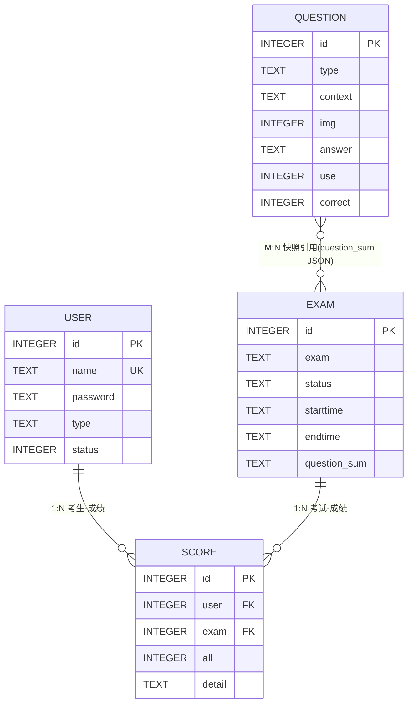

关系说明：
- user → score：1:N，score.user物理外键→user.id
- exam → score：1:N，score.exam物理外键→exam.id
- exam → question：M:N（快照），由exam.question_sum JSON字段表达，无中间表
- user → question：隐式1:N，question不存creator_id

### 3.2 实体类图

用Mermaid classDiagram语法给出4个实体类的属性与操作：

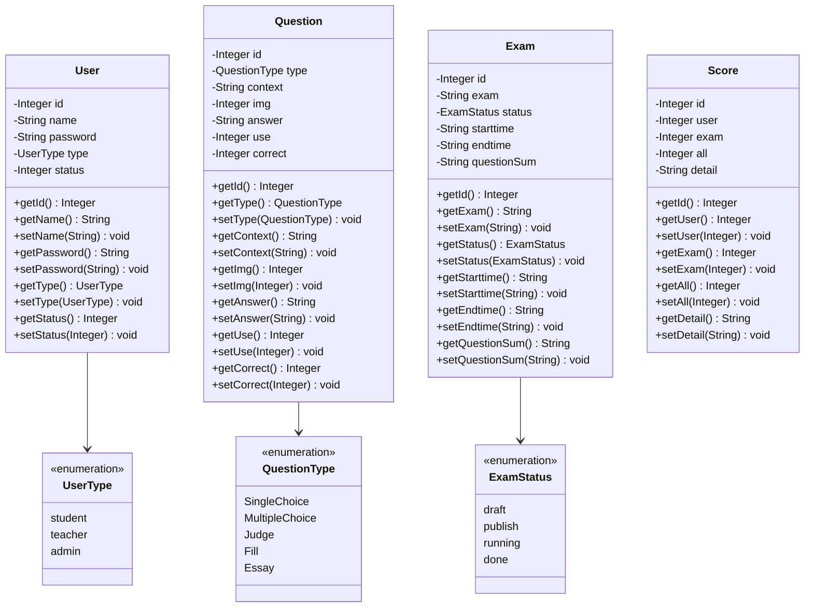

### 数据来源
- wiki/02-Data-Dictionary.md §2 ER关系总览、§4 字段级定义
- Entity代码：User.java、Question.java、Exam.java、Score.java
- Enum代码：UserType.java、QuestionType.java、ExamStatus.java

### 预估篇幅：1页ER图 + 1页类图 + 800字说明

---

## 第4章：子系统用例图

### M01 用户认证模块用例图（11个用例）

参与者：学生(student)、教师(teacher)、管理员(admin)

用例列表（从UserController.java端点反推）：
1. UC-M01-01 用户登录 (POST /api/v1/auth/login) — 公开
2. UC-M01-02 用户注册 (POST /api/v1/auth/register) — 公开
3. UC-M01-03 用户登出 (POST /api/v1/auth/logout) — student/teacher/admin
4. UC-M01-04 获取当前用户信息 (GET /api/v1/auth/me) — student/teacher/admin
5. UC-M01-05 修改密码 (POST /api/v1/auth/password) — student/teacher/admin
6. UC-M01-06 分页查询用户列表 (GET /api/v1/users) — admin
7. UC-M01-07 创建用户 (POST /api/v1/users) — admin
8. UC-M01-08 更新用户 (PUT /api/v1/users/{id}) — admin
9. UC-M01-09 更新用户状态 (PATCH /api/v1/users/{id}/status) — admin
10. UC-M01-10 删除用户 (DELETE /api/v1/users/{id}) — admin
11. UC-M01-11 批量删除用户 (DELETE /api/v1/users/batch) — admin

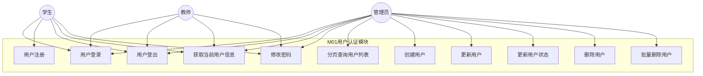

### M02 题库管理模块用例图（8个用例）

参与者：教师(teacher)、管理员(admin)

用例列表（从QuestionController.java端点反推）：
1. UC-M02-01 创建题目 (POST /api/v1/questions) — teacher/admin
2. UC-M02-02 批量导入题目 (POST /api/v1/questions/batch) — teacher/admin
3. UC-M02-03 查询题目详情 (GET /api/v1/questions/{id}) — teacher/admin
4. UC-M02-04 分页查询题目列表 (GET /api/v1/questions) — teacher/admin
5. UC-M02-05 更新题目 (PUT /api/v1/questions/{id}) — teacher/admin
6. UC-M02-06 删除题目 (DELETE /api/v1/questions/{id}) — teacher/admin
7. UC-M02-07 批量删除题目 (DELETE /api/v1/questions/batch) — teacher/admin
8. UC-M02-08 随机获取题目 (GET /api/v1/questions/random) — teacher/admin

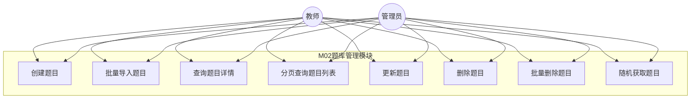

### M03 组卷与考试模块用例图（10个用例）

参与者：学生(student)、教师(teacher)、管理员(admin)

用例列表（从ExamController.java端点反推）：
1. UC-M03-01 创建手动组卷考试 (POST /api/v1/exams/manual) — teacher/admin
2. UC-M03-02 创建自动组卷考试 (POST /api/v1/exams/auto) — teacher/admin
3. UC-M03-03 获取可参加考试列表 (GET /api/v1/exams/available) — student
4. UC-M03-04 获取考试详情 (GET /api/v1/exams/{id}) — teacher/admin
5. UC-M03-05 学生预览考试 (GET /api/v1/exams/{id}/preview) — student
6. UC-M03-06 修改考试 (PUT /api/v1/exams/{id}) — teacher/admin
7. UC-M03-07 发布考试 (POST /api/v1/exams/{id}/publish) — teacher/admin
8. UC-M03-08 撤回考试 (POST /api/v1/exams/{id}/withdraw) — teacher/admin
9. UC-M03-09 删除考试 (DELETE /api/v1/exams/{id}) — teacher/admin
10. UC-M03-10 分页查询考试列表 (GET /api/v1/exams) — teacher/admin

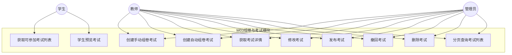

### M04 成绩统计模块用例图（9个用例）

参与者：学生(student)、教师(teacher)、管理员(admin)

用例列表（从ScoreController.java端点反推）：
1. UC-M04-01 提交答卷 (POST /api/v1/exams/{examId}/submit) — student
2. UC-M04-02 教师评卷 (POST /api/v1/scores/{scoreId}/grade-essay) — teacher/admin
3. UC-M04-03 查询我的成绩 (GET /api/v1/scores/me) — student/teacher/admin
4. UC-M04-04 查询我的错题集 (GET /api/v1/scores/me/mistakes) — student
5. UC-M04-05 查询分数详情 (GET /api/v1/scores/{id}) — student/teacher/admin
6. UC-M04-06 查询考试所有考生分数 (GET /api/v1/exams/{examId}/scores) — teacher/admin
7. UC-M04-07 考试统计报表 (GET /api/v1/statistics/exams/{examId}) — teacher/admin
8. UC-M04-08 题目统计列表 (GET /api/v1/statistics/questions) — teacher/admin
9. UC-M04-09 单题详细统计 (GET /api/v1/statistics/questions/{id}) — teacher/admin

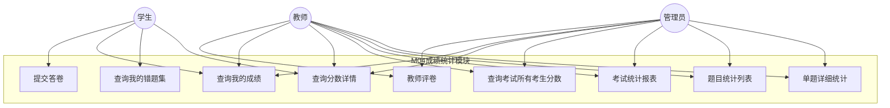

### 数据来源
- UserController.java（11个端点）
- QuestionController.java（8个端点）
- ExamController.java（10个端点）
- ScoreController.java（9个端点）
- wiki/modules/M01~M04 各模块文档

### 预估篇幅：4页用例图 + 800字说明

---

## 第5章：子系统各个用例的描述

### M01 用户认证模块用例描述（11个）

#### UC-M01-01 用户登录

| 项目 | 描述 |
|---|---|
| 用例编号 | UC-M01-01 |
| 用例名称 | 用户登录 |
| 参与者 | 学生、教师、管理员 |
| 前置条件 | 用户已注册，账号未被禁用 |
| 主事件流 | 1.用户输入用户名和密码 2.系统查询用户记录 3.系统校验密码（BCrypt比对） 4.系统签发JWT Token 5.返回Token和用户信息 |
| 后置条件 | 用户获得有效Token，可访问受保护接口 |
| 数据来源 | UserController.login()、UserService.login()、JwtUtil.generateToken() |

#### UC-M01-02 用户注册

| 项目 | 描述 |
|---|---|
| 用例编号 | UC-M01-02 |
| 用例名称 | 用户注册 |
| 参与者 | 学生（仅学生可自助注册） |
| 前置条件 | 用户名未被占用 |
| 主事件流 | 1.用户输入用户名、密码、用户类型 2.系统校验用户名唯一性 3.系统校验仅学生可自助注册 4.密码BCrypt加密 5.创建用户记录（status=1） 6.返回用户信息 |
| 后置条件 | 新用户记录已创建，状态为启用 |
| 数据来源 | UserController.register()、UserService.register() |

#### UC-M01-03 用户登出

| 项目 | 描述 |
|---|---|
| 用例编号 | UC-M01-03 |
| 用例名称 | 用户登出 |
| 参与者 | 学生、教师、管理员 |
| 前置条件 | 用户已登录 |
| 主事件流 | 1.用户请求登出 2.系统返回成功（JWT无状态，前端删除Token即可） |
| 后置条件 | 前端清除Token，用户需重新登录 |
| 数据来源 | UserController.logout() |

#### UC-M01-04 获取当前用户信息

| 项目 | 描述 |
|---|---|
| 用例编号 | UC-M01-04 |
| 用例名称 | 获取当前用户信息 |
| 参与者 | 学生、教师、管理员 |
| 前置条件 | 用户已登录（携带有效Token） |
| 主事件流 | 1.系统从请求属性获取userId 2.查询用户信息 3.转换为UserVO返回（不含密码） |
| 后置条件 | 返回当前用户的基本信息 |
| 数据来源 | UserController.getCurrentUser()、UserService.getCurrentUser() |

#### UC-M01-05 修改密码

| 项目 | 描述 |
|---|---|
| 用例编号 | UC-M01-05 |
| 用例名称 | 修改密码 |
| 参与者 | 学生、教师、管理员 |
| 前置条件 | 用户已登录，知道旧密码 |
| 主事件流 | 1.用户输入旧密码和新密码 2.系统校验旧密码（BCrypt比对） 3.新密码BCrypt加密 4.更新用户密码 5.返回成功 |
| 后置条件 | 用户密码已更新 |
| 数据来源 | UserController.changePassword()、UserService.changePassword() |

#### UC-M01-06 分页查询用户列表

| 项目 | 描述 |
|---|---|
| 用例编号 | UC-M01-06 |
| 用例名称 | 分页查询用户列表 |
| 参与者 | 管理员 |
| 前置条件 | 管理员已登录 |
| 主事件流 | 1.管理员输入分页参数和筛选条件（type/status） 2.系统按条件查询用户列表 3.转换为UserVO分页结果返回 |
| 后置条件 | 返回用户列表分页数据 |
| 数据来源 | UserController.listUsers()、UserService.listUsers() |

#### UC-M01-07 创建用户

| 项目 | 描述 |
|---|---|
| 用例编号 | UC-M01-07 |
| 用例名称 | 创建用户 |
| 参与者 | 管理员 |
| 前置条件 | 管理员已登录，用户名未被占用 |
| 主事件流 | 1.管理员输入用户名、密码、用户类型 2.系统校验用户名唯一性 3.密码BCrypt加密 4.创建用户记录（可创建任意角色） 5.返回用户信息 |
| 后置条件 | 新用户记录已创建 |
| 数据来源 | UserController.createUser()、UserService.createUser() |

#### UC-M01-08 更新用户

| 项目 | 描述 |
|---|---|
| 用例编号 | UC-M01-08 |
| 用例名称 | 更新用户 |
| 参与者 | 管理员 |
| 前置条件 | 管理员已登录，目标用户存在 |
| 主事件流 | 1.管理员输入用户ID和更新信息 2.系统查询目标用户 3.若修改name则校验唯一性 4.更新用户信息 5.返回更新后的用户信息 |
| 后置条件 | 用户信息已更新 |
| 数据来源 | UserController.updateUser()、UserService.updateUser() |

#### UC-M01-09 更新用户状态

| 项目 | 描述 |
|---|---|
| 用例编号 | UC-M01-09 |
| 用例名称 | 更新用户状态 |
| 参与者 | 管理员 |
| 前置条件 | 管理员已登录，目标用户存在 |
| 主事件流 | 1.管理员输入用户ID和目标状态 2.系统查询目标用户 3.若禁用admin则检查是否为最后一个 4.更新用户状态 5.返回成功 |
| 后置条件 | 用户状态已更新 |
| 数据来源 | UserController.updateUserStatus()、UserService.updateUserStatus() |

#### UC-M01-10 删除用户

| 项目 | 描述 |
|---|---|
| 用例编号 | UC-M01-10 |
| 用例名称 | 删除用户 |
| 参与者 | 管理员 |
| 前置条件 | 管理员已登录，目标用户存在，不能删除自己 |
| 主事件流 | 1.管理员输入用户ID 2.系统校验不能删除自己 3.系统校验不能删除最后一个admin 4.若用户有考试记录则禁用而非删除 5.否则硬删除用户 6.返回成功 |
| 后置条件 | 用户被删除或禁用 |
| 数据来源 | UserController.deleteUser()、UserService.deleteUser() |

#### UC-M01-11 批量删除用户

| 项目 | 描述 |
|---|---|
| 用例编号 | UC-M01-11 |
| 用例名称 | 批量删除用户 |
| 参与者 | 管理员 |
| 前置条件 | 管理员已登录 |
| 主事件流 | 1.管理员输入用户ID列表 2.系统逐个调用删除用户逻辑 3.返回成功 |
| 后置条件 | 指定用户被删除或禁用 |
| 数据来源 | UserController.batchDeleteUsers()、UserService.batchDeleteUsers() |

### M02 题库管理模块用例描述（8个）

#### UC-M02-01 创建题目

| 项目 | 描述 |
|---|---|
| 用例编号 | UC-M02-01 |
| 用例名称 | 创建题目 |
| 参与者 | 教师、管理员 |
| 前置条件 | 用户已登录且具有teacher或admin角色 |
| 主事件流 | 1.用户输入题目类型、题干、是否带图、答案JSON 2.系统校验答案JSON与题型匹配 3.创建题目记录（use=0, correct=0） 4.返回题目信息 |
| 后置条件 | 新题目记录已创建 |
| 数据来源 | QuestionController.createQuestion()、QuestionService.create() |

#### UC-M02-02 批量导入题目

| 项目 | 描述 |
|---|---|
| 用例编号 | UC-M02-02 |
| 用例名称 | 批量导入题目 |
| 参与者 | 教师、管理员 |
| 前置条件 | 用户已登录且具有teacher或admin角色 |
| 主事件流 | 1.用户提交题目数组 2.系统逐题校验并创建 3.统计成功数和失败数 4.返回批量导入结果 |
| 后置条件 | 成功的题目记录已创建 |
| 数据来源 | QuestionController.batchImportQuestions()、QuestionService.batchCreate() |

#### UC-M02-03 查询题目详情

| 项目 | 描述 |
|---|---|
| 用例编号 | UC-M02-03 |
| 用例名称 | 查询题目详情 |
| 参与者 | 教师、管理员 |
| 前置条件 | 用户已登录且具有teacher或admin角色，题目存在 |
| 主事件流 | 1.用户输入题目ID 2.系统查询题目记录 3.转换为QuestionVO返回（含答案和统计） |
| 后置条件 | 返回题目完整信息 |
| 数据来源 | QuestionController.getQuestionById()、QuestionService.findById() |

#### UC-M02-04 分页查询题目列表

| 项目 | 描述 |
|---|---|
| 用例编号 | UC-M02-04 |
| 用例名称 | 分页查询题目列表 |
| 参与者 | 教师、管理员 |
| 前置条件 | 用户已登录且具有teacher或admin角色 |
| 主事件流 | 1.用户输入筛选条件（type/keyword）和分页参数 2.系统按条件查询题目列表 3.转换为QuestionVO分页结果返回 |
| 后置条件 | 返回题目列表分页数据 |
| 数据来源 | QuestionController.listQuestions()、QuestionService.search() |

#### UC-M02-05 更新题目

| 项目 | 描述 |
|---|---|
| 用例编号 | UC-M02-05 |
| 用例名称 | 更新题目 |
| 参与者 | 教师、管理员 |
| 前置条件 | 用户已登录且具有teacher或admin角色，题目存在 |
| 主事件流 | 1.用户输入题目ID和更新信息 2.系统查询目标题目 3.校验答案JSON与题型匹配 4.更新题目信息 5.返回更新后的题目信息 |
| 后置条件 | 题目信息已更新 |
| 数据来源 | QuestionController.updateQuestion()、QuestionService.update() |

#### UC-M02-06 删除题目

| 项目 | 描述 |
|---|---|
| 用例编号 | UC-M02-06 |
| 用例名称 | 删除题目 |
| 参与者 | 教师、管理员 |
| 前置条件 | 用户已登录且具有teacher或admin角色，题目存在 |
| 主事件流 | 1.用户输入题目ID 2.系统校验题目未被考试引用（或警告） 3.删除题目记录 4.返回成功 |
| 后置条件 | 题目记录已删除 |
| 数据来源 | QuestionController.deleteQuestion()、QuestionService.delete() |

#### UC-M02-07 批量删除题目

| 项目 | 描述 |
|---|---|
| 用例编号 | UC-M02-07 |
| 用例名称 | 批量删除题目 |
| 参与者 | 教师、管理员 |
| 前置条件 | 用户已登录且具有teacher或admin角色 |
| 主事件流 | 1.用户输入题目ID列表 2.系统逐个调用删除题目逻辑 3.返回成功 |
| 后置条件 | 指定题目被删除 |
| 数据来源 | QuestionController.batchDeleteQuestions() |

#### UC-M02-08 随机获取题目

| 项目 | 描述 |
|---|---|
| 用例编号 | UC-M02-08 |
| 用例名称 | 随机获取题目 |
| 参与者 | 教师、管理员 |
| 前置条件 | 用户已登录且具有teacher或admin角色 |
| 主事件流 | 1.用户输入题型过滤和排除ID列表 2.系统按条件随机查询一道题目 3.返回题目预览信息（不含答案） |
| 后置条件 | 返回随机题目预览 |
| 数据来源 | QuestionController.getRandomQuestion()、QuestionService.getRandomQuestion() |

### M03 组卷与考试模块用例描述（10个）

#### UC-M03-01 创建手动组卷考试

| 项目 | 描述 |
|---|---|
| 用例编号 | UC-M03-01 |
| 用例名称 | 创建手动组卷考试 |
| 参与者 | 教师、管理员 |
| 前置条件 | 用户已登录且具有teacher或admin角色，所选题目均存在 |
| 主事件流 | 1.用户输入考试名称、开始/结束时间、题目项列表[{questionId, score}] 2.系统校验所有questionId存在 3.构造question_sum JSON快照 4.创建考试记录（status=draft） 5.为每个被抽中题目执行use+=1 6.返回考试信息 |
| 后置条件 | 新考试记录已创建，状态为草稿 |
| 数据来源 | ExamController.createManualExam()、ExamService.createManualExam() |

#### UC-M03-02 创建自动组卷考试

| 项目 | 描述 |
|---|---|
| 用例编号 | UC-M03-02 |
| 用例名称 | 创建自动组卷考试 |
| 参与者 | 教师、管理员 |
| 前置条件 | 用户已登录且具有teacher或admin角色，题库中有足够题目 |
| 主事件流 | 1.用户输入考试名称、开始/结束时间、自动组卷规则{totalQuestions, totalScore, typeFilter, usePenalty} 2.系统按规则随机抽题 3.构造question_sum JSON快照 4.创建考试记录（status=draft） 5.为每个被抽中题目执行use+=1 6.返回考试信息 |
| 后置条件 | 新考试记录已创建，状态为草稿 |
| 数据来源 | ExamController.createAutoExam()、ExamService.createAutoExam() |

#### UC-M03-03 获取可参加考试列表

| 项目 | 描述 |
|---|---|
| 用例编号 | UC-M03-03 |
| 用例名称 | 获取可参加考试列表 |
| 参与者 | 学生 |
| 前置条件 | 学生已登录 |
| 主事件流 | 1.学生请求可参加的考试列表 2.系统查询publish/running状态的考试 3.实时计算考试状态（按时间窗） 4.转换为ExamForStudentVO返回（脱敏，剔除答案） |
| 后置条件 | 返回可参加的考试列表 |
| 数据来源 | ExamController.listAvailableExams()、ExamService.listAvailableExams() |

#### UC-M03-04 获取考试详情

| 项目 | 描述 |
|---|---|
| 用例编号 | UC-M03-04 |
| 用例名称 | 获取考试详情 |
| 参与者 | 教师、管理员 |
| 前置条件 | 用户已登录且具有teacher或admin角色，考试存在 |
| 主事件流 | 1.用户输入考试ID 2.系统查询考试记录 3.解析question_sum JSON 4.转换为ExamVO返回（含完整题目信息和答案） |
| 后置条件 | 返回考试完整信息 |
| 数据来源 | ExamController.getExamById()、ExamService.getExamById() |

#### UC-M03-05 学生预览考试

| 项目 | 描述 |
|---|---|
| 用例编号 | UC-M03-05 |
| 用例名称 | 学生预览考试 |
| 参与者 | 学生 |
| 前置条件 | 学生已登录，考试存在 |
| 主事件流 | 1.学生输入考试ID 2.系统查询考试记录 3.转换为ExamForStudentVO返回（脱敏，剔除答案，仅保留选项） |
| 后置条件 | 返回考试预览信息（不含答案） |
| 数据来源 | ExamController.getExamForStudent()、ExamService.getExamForStudent() |

#### UC-M03-06 修改考试

| 项目 | 描述 |
|---|---|
| 用例编号 | UC-M03-06 |
| 用例名称 | 修改考试 |
| 参与者 | 教师、管理员 |
| 前置条件 | 用户已登录且具有teacher或admin角色，考试处于draft状态 |
| 主事件流 | 1.用户输入考试ID和更新信息 2.系统校验考试状态为draft 3.更新考试信息 4.返回更新后的考试信息 |
| 后置条件 | 考试信息已更新 |
| 数据来源 | ExamController.updateExam()、ExamService.updateExam() |

#### UC-M03-07 发布考试

| 项目 | 描述 |
|---|---|
| 用例编号 | UC-M03-07 |
| 用例名称 | 发布考试 |
| 参与者 | 教师、管理员 |
| 前置条件 | 用户已登录且具有teacher或admin角色，考试处于draft状态 |
| 主事件流 | 1.用户输入考试ID 2.系统校验考试状态为draft 3.更新状态为publish 4.返回成功 |
| 后置条件 | 考试状态变为publish |
| 数据来源 | ExamController.publishExam()、ExamService.publishExam() |

#### UC-M03-08 撤回考试

| 项目 | 描述 |
|---|---|
| 用例编号 | UC-M03-08 |
| 用例名称 | 撤回考试 |
| 参与者 | 教师、管理员 |
| 前置条件 | 用户已登录且具有teacher或admin角色，考试处于publish状态 |
| 主事件流 | 1.用户输入考试ID 2.系统校验考试状态为publish 3.更新状态为draft 4.返回成功 |
| 后置条件 | 考试状态变为draft |
| 数据来源 | ExamController.withdrawExam()、ExamService.withdrawExam() |

#### UC-M03-09 删除考试

| 项目 | 描述 |
|---|---|
| 用例编号 | UC-M03-09 |
| 用例名称 | 删除考试 |
| 参与者 | 教师、管理员 |
| 前置条件 | 用户已登录且具有teacher或admin角色，考试处于draft状态 |
| 主事件流 | 1.用户输入考试ID 2.系统校验考试状态为draft 3.删除考试记录 4.返回成功 |
| 后置条件 | 考试记录已删除 |
| 数据来源 | ExamController.deleteExam()、ExamService.deleteExam() |

#### UC-M03-10 分页查询考试列表

| 项目 | 描述 |
|---|---|
| 用例编号 | UC-M03-10 |
| 用例名称 | 分页查询考试列表 |
| 参与者 | 教师、管理员 |
| 前置条件 | 用户已登录且具有teacher或admin角色 |
| 主事件流 | 1.用户输入筛选条件（status）和分页参数 2.系统按条件查询考试列表 3.转换为ExamVO分页结果返回 |
| 后置条件 | 返回考试列表分页数据 |
| 数据来源 | ExamController.listExams()、ExamService.listExams() |

### M04 成绩统计模块用例描述（9个）

#### UC-M04-01 提交答卷

| 项目 | 描述 |
|---|---|
| 用例编号 | UC-M04-01 |
| 用例名称 | 提交答卷 |
| 参与者 | 学生 |
| 前置条件 | 学生已登录，考试处于running状态，未重复提交 |
| 主事件流 | 1.学生输入考试ID和答题列表[{questionId, userAnswer}] 2.系统校验考试状态为running 3.读取exam.question_sum确定题序与分值 4.逐题判分（客观题自动比对，简答题暂存待评） 5.计算总分 6.构造score.detail JSON 7.UPSERT score表 8.为每个isCorrect=true的题目执行correct+=1 9.返回分数信息 |
| 后置条件 | 成绩记录已创建/更新 |
| 数据来源 | ScoreController.submitExam()、ScoreService.submitExam() |

#### UC-M04-02 教师评卷

| 项目 | 描述 |
|---|---|
| 用例编号 | UC-M04-02 |
| 用例名称 | 教师评卷 |
| 参与者 | 教师、管理员 |
| 前置条件 | 用户已登录且具有teacher或admin角色，分数记录存在 |
| 主事件流 | 1.教师输入分数ID和评卷信息[{questionId, score}] 2.系统查询分数记录 3.更新简答题得分和isCorrect 4.重新计算总分和准确率 5.若isCorrect变更则更新question.correct 6.返回更新后的分数信息 |
| 后置条件 | 简答题评分已更新 |
| 数据来源 | ScoreController.gradeEssay()、ScoreService.gradeEssay() |

#### UC-M04-03 查询我的成绩

| 项目 | 描述 |
|---|---|
| 用例编号 | UC-M04-03 |
| 用例名称 | 查询我的成绩 |
| 参与者 | 学生、教师、管理员 |
| 前置条件 | 用户已登录 |
| 主事件流 | 1.用户请求个人成绩列表 2.系统从请求属性获取userId 3.查询该用户的所有成绩记录 4.转换为ScoreListVO分页结果返回 |
| 后置条件 | 返回个人成绩列表 |
| 数据来源 | ScoreController.getMyScores()、ScoreService.getMyScores() |

#### UC-M04-04 查询我的错题集

| 项目 | 描述 |
|---|---|
| 用例编号 | UC-M04-04 |
| 用例名称 | 查询我的错题集 |
| 参与者 | 学生 |
| 前置条件 | 学生已登录 |
| 主事件流 | 1.学生请求错题集 2.系统从请求属性获取userId 3.查询该用户所有成绩记录 4.从detail JSON中筛选isCorrect=false的题目 5.转换为MistakeItemVO分页结果返回 |
| 后置条件 | 返回错题列表 |
| 数据来源 | ScoreController.getMyMistakes()、ScoreService.getMyMistakes() |

#### UC-M04-05 查询分数详情

| 项目 | 描述 |
|---|---|
| 用例编号 | UC-M04-05 |
| 用例名称 | 查询分数详情 |
| 参与者 | 学生、教师、管理员 |
| 前置条件 | 用户已登录，分数记录存在 |
| 主事件流 | 1.用户输入分数ID 2.系统查询分数记录 3.解析detail JSON 4.转换为ScoreVO返回（含逐题明细） |
| 后置条件 | 返回分数完整信息 |
| 数据来源 | ScoreController.getScoreById()、ScoreService.findById() |

#### UC-M04-06 查询考试所有考生分数

| 项目 | 描述 |
|---|---|
| 用例编号 | UC-M04-06 |
| 用例名称 | 查询考试所有考生分数 |
| 参与者 | 教师、管理员 |
| 前置条件 | 用户已登录且具有teacher或admin角色 |
| 主事件流 | 1.用户输入考试ID和分页参数 2.系统查询该考试的所有成绩记录 3.转换为ScoreListVO分页结果返回 |
| 后置条件 | 返回考试成绩列表 |
| 数据来源 | ScoreController.getExamScores()、ScoreService.getExamScores() |

#### UC-M04-07 考试统计报表

| 项目 | 描述 |
|---|---|
| 用例编号 | UC-M04-07 |
| 用例名称 | 考试统计报表 |
| 参与者 | 教师、管理员 |
| 前置条件 | 用户已登录且具有teacher或admin角色 |
| 主事件流 | 1.用户输入考试ID 2.系统查询该考试的所有成绩记录 3.计算参与人数、平均分、最高分、最低分、通过率 4.转换为ExamStatisticsVO返回 |
| 后置条件 | 返回考试统计报表 |
| 数据来源 | ScoreController.getExamStatistics()、ScoreService.getExamStatistics() |

#### UC-M04-08 题目统计列表

| 项目 | 描述 |
|---|---|
| 用例编号 | UC-M04-08 |
| 用例名称 | 题目统计列表 |
| 参与者 | 教师、管理员 |
| 前置条件 | 用户已登录且具有teacher或admin角色 |
| 主事件流 | 1.用户输入分页参数和排序字段 2.系统查询所有题目的统计信息 3.计算每题的使用次数、正确次数、正确率 4.转换为QuestionStatisticsVO分页结果返回 |
| 后置条件 | 返回题目统计列表 |
| 数据来源 | ScoreController.getQuestionStatistics()、ScoreService.getQuestionStatisticsPaginated() |

#### UC-M04-09 单题详细统计

| 项目 | 描述 |
|---|---|
| 用例编号 | UC-M04-09 |
| 用例名称 | 单题详细统计 |
| 参与者 | 教师、管理员 |
| 前置条件 | 用户已登录且具有teacher或admin角色，题目存在 |
| 主事件流 | 1.用户输入题目ID 2.系统查询题目统计信息 3.返回单题详细统计 |
| 后置条件 | 返回单题统计信息 |
| 数据来源 | ScoreController.getQuestionStatisticById()、ScoreService.getQuestionStatisticById() |

### 数据来源
- 各Controller端点代码
- 各Service业务逻辑代码
- wiki/modules/M01~M04 各模块文档

### 预估篇幅：38个用例 × 约150字/用例 = 约6000字

---

## 第6章：用例描述所涉及的时序图

为每个用例提供Mermaid sequenceDiagram草案。以下是全部38个用例的时序图：

### M01 时序图（11个）

#### UC-M01-01 用户登录

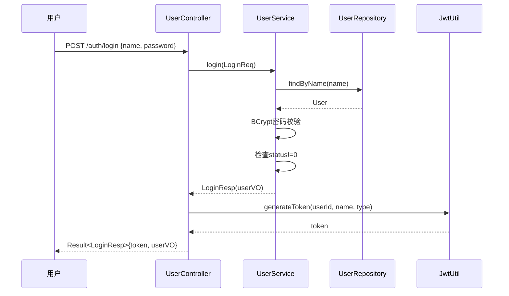

#### UC-M01-02 用户注册

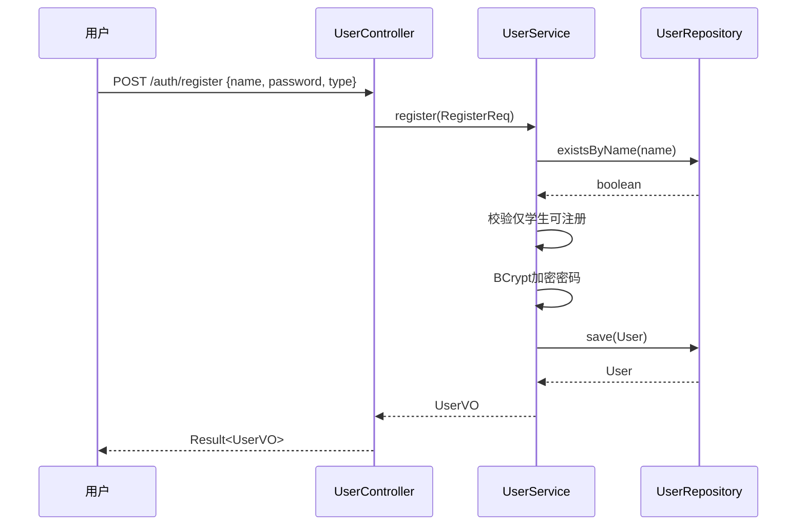

#### UC-M01-03 用户登出

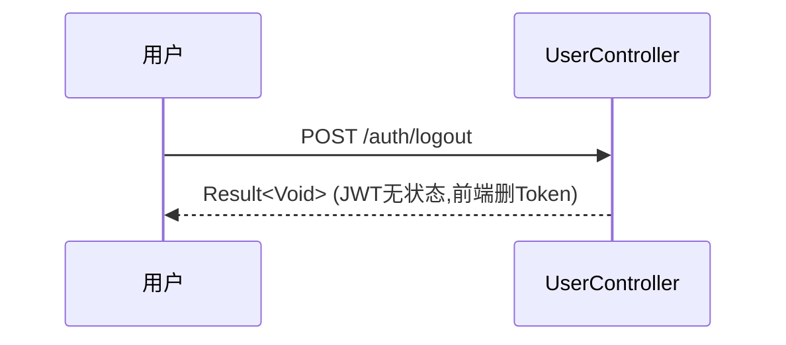

#### UC-M01-04 获取当前用户信息

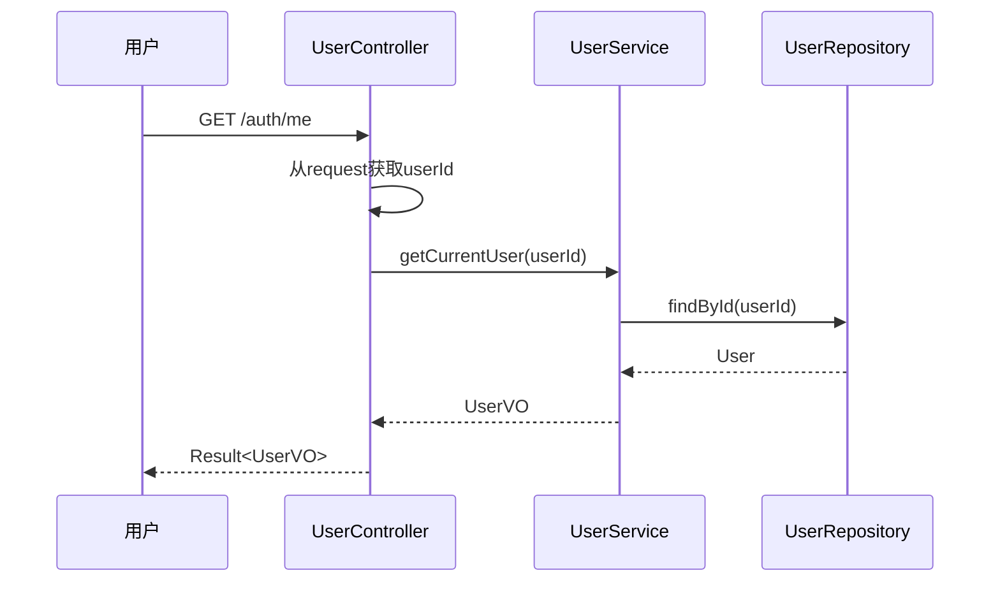

#### UC-M01-05 修改密码

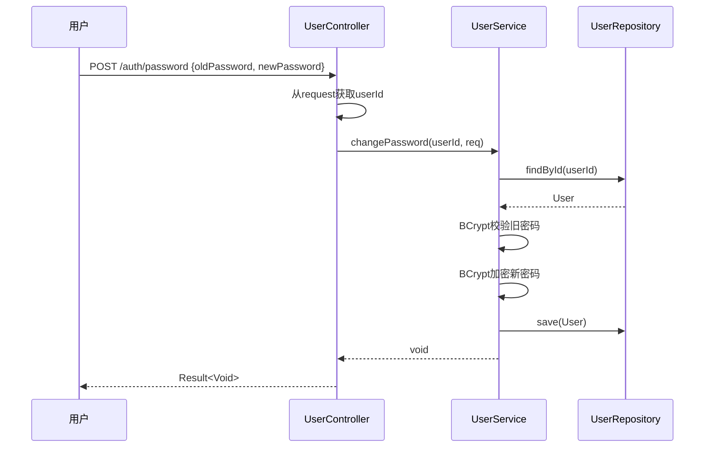

#### UC-M01-06 分页查询用户列表

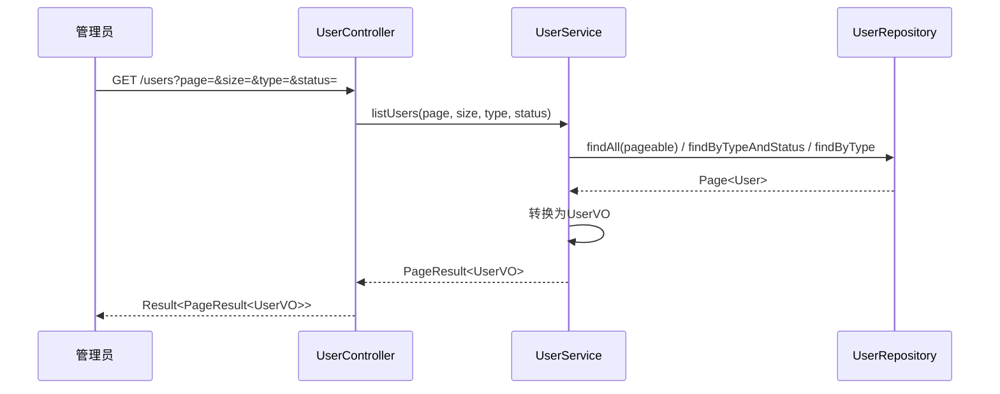

#### UC-M01-07 创建用户

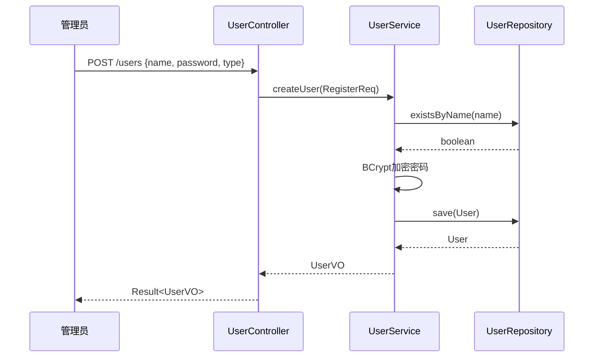

#### UC-M01-08 更新用户

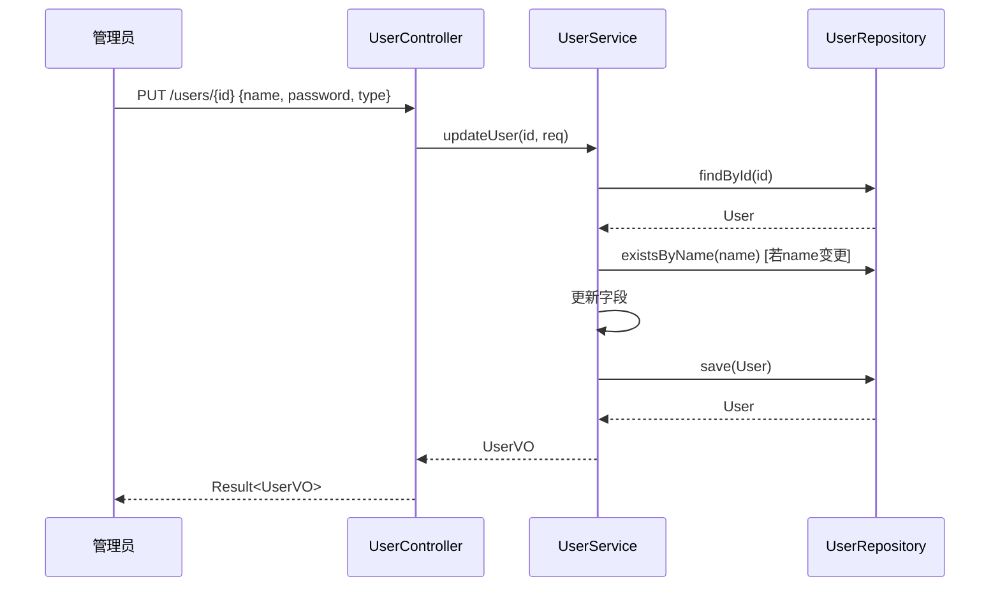

#### UC-M01-09 更新用户状态

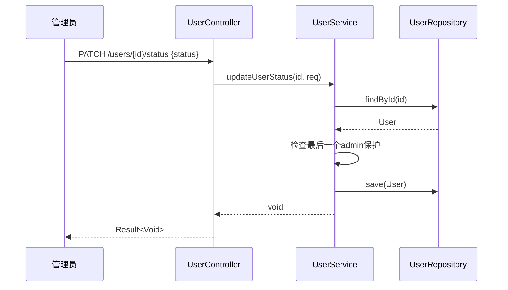

#### UC-M01-10 删除用户

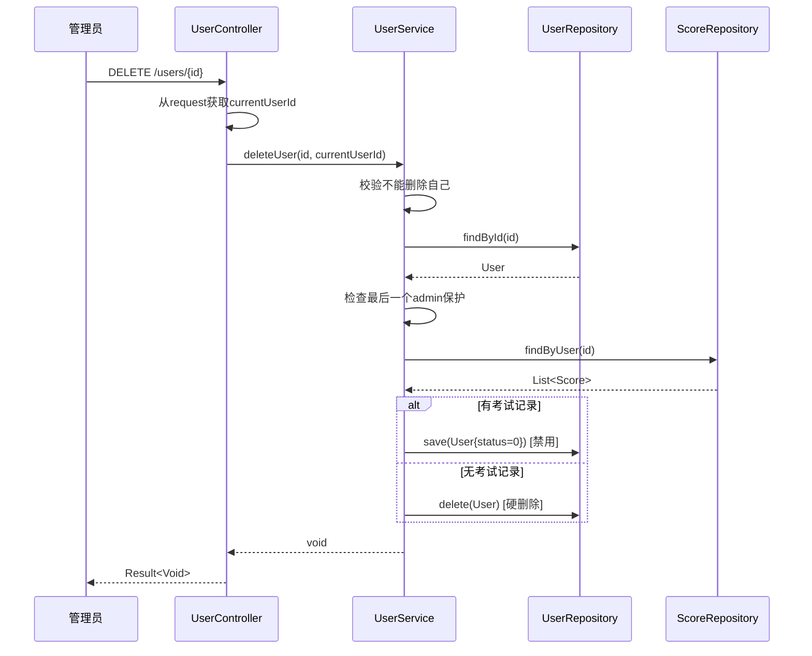

#### UC-M01-11 批量删除用户

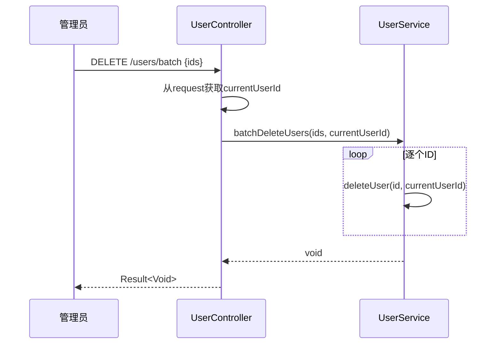

### M02 时序图（8个）

#### UC-M02-01 创建题目

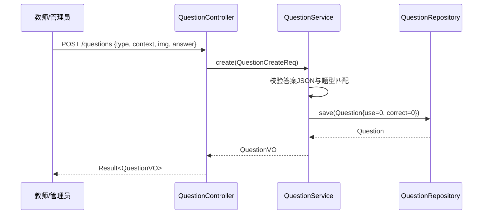

#### UC-M02-02 批量导入题目

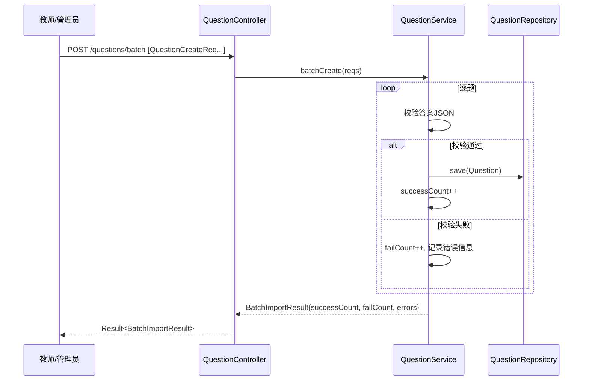

#### UC-M02-03 查询题目详情

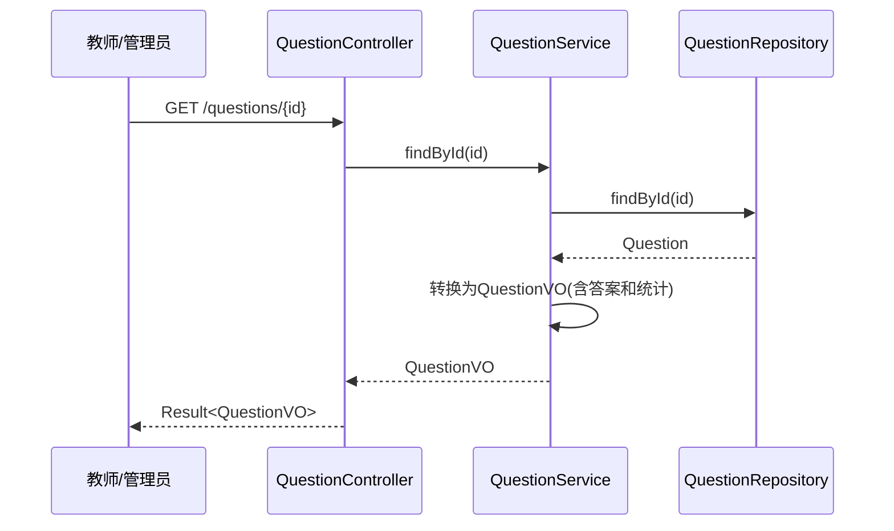

#### UC-M02-04 分页查询题目列表

```mermaid
sequenceDiagram
    participant T as 教师/管理员
    participant C as QuestionController
    participant S as QuestionService
    participant R as QuestionRepository
    T->>C: GET /questions?type=&keyword=&page=&size=
    C->>S: search(QuestionQueryReq)
    S->>R: 按条件分页查询
    R-->>S: Page<Question>
    S->>S: 转换为QuestionVO
    S-->>C: Page<QuestionVO>
    C-->>T: Result<PageResult<QuestionVO>>
```

#### UC-M02-05 更新题目

```mermaid
sequenceDiagram
    participant T as 教师/管理员
    participant C as QuestionController
    participant S as QuestionService
    participant R as QuestionRepository
    T->>C: PUT /questions/{id} {context, img, answer}
    C->>S: update(id, QuestionUpdateReq)
    S->>R: findById(id)
    R-->>S: Question
    S->>S: 校验答案JSON与题型匹配
    S->>S: 更新字段
    S->>R: save(Question)
    R-->>S: Question
    S-->>C: QuestionVO
    C-->>T: Result<QuestionVO>
```

#### UC-M02-06 删除题目

```mermaid
sequenceDiagram
    participant T as 教师/管理员
    participant C as QuestionController
    participant S as QuestionService
    participant R as QuestionRepository
    T->>C: DELETE /questions/{id}
    C->>S: delete(id)
    S->>R: findById(id)
    R-->>S: Question
    S->>R: delete(Question)
    S-->>C: void
    C-->>T: Result<Void>
```

#### UC-M02-07 批量删除题目

```mermaid
sequenceDiagram
    participant T as 教师/管理员
    participant C as QuestionController
    participant S as QuestionService
    T->>C: DELETE /questions/batch [ids]
    loop 逐个ID
        C->>S: delete(id)
    end
    C-->>T: Result<Void>
```

#### UC-M02-08 随机获取题目

```mermaid
sequenceDiagram
    participant T as 教师/管理员
    participant C as QuestionController
    participant S as QuestionService
    participant R as QuestionRepository
    T->>C: GET /questions/random?type=&excludedIds=
    C->>S: getRandomQuestion(type, excludedIds)
    S->>R: 按条件随机查询
    R-->>S: Question
    S->>S: 转换为QuestionPreviewVO(不含答案)
    S-->>C: QuestionPreviewVO
    C-->>T: Result<QuestionPreviewVO>
```

### M03 时序图（10个）

#### UC-M03-01 创建手动组卷考试

```mermaid
sequenceDiagram
    participant T as 教师/管理员
    participant C as ExamController
    participant S as ExamService
    participant ER as ExamRepository
    participant QR as QuestionRepository
    T->>C: POST /exams/manual {exam, starttime, endtime, items[]}
    C->>S: createManualExam(ExamCreateManualReq)
    S->>S: 校验所有questionId存在
    S->>QR: findById(questionId) [逐题]
    QR-->>S: Question
    S->>S: 构造question_sum JSON快照
    S->>S: 为每个题目use+=1
    S->>QR: incrementUse(questionId) [逐题]
    S->>ER: save(Exam{status=draft})
    ER-->>S: Exam
    S-->>C: ExamVO
    C-->>T: Result<ExamVO>
```

#### UC-M03-02 创建自动组卷考试

```mermaid
sequenceDiagram
    participant T as 教师/管理员
    participant C as ExamController
    participant S as ExamService
    participant ER as ExamRepository
    participant QR as QuestionRepository
    T->>C: POST /exams/auto {exam, starttime, endtime, rule}
    C->>S: createAutoExam(ExamCreateAutoReq)
    S->>QR: 按typeFilter查询候选题目
    QR-->>S: List<Question>
    S->>S: 按rule随机抽题(usePenalty加权)
    S->>S: 构造question_sum JSON快照
    S->>S: 为每个题目use+=1
    S->>QR: incrementUse(questionId) [逐题]
    S->>ER: save(Exam{status=draft})
    ER-->>S: Exam
    S-->>C: ExamVO
    C-->>T: Result<ExamVO>
```

#### UC-M03-03 获取可参加考试列表

```mermaid
sequenceDiagram
    participant S as 学生
    participant C as ExamController
    participant ES as ExamService
    participant R as ExamRepository
    S->>C: GET /exams/available
    C->>ES: listAvailableExams()
    ES->>R: findByStatus(publish/running)
    R-->>ES: List<Exam>
    ES->>ES: 实时计算状态(时间窗)
    ES->>ES: 转换为ExamForStudentVO(脱敏)
    ES-->>C: List<ExamForStudentVO>
    C-->>S: Result<List<ExamForStudentVO>>
```

#### UC-M03-04 获取考试详情

```mermaid
sequenceDiagram
    participant T as 教师/管理员
    participant C as ExamController
    participant S as ExamService
    participant R as ExamRepository
    T->>C: GET /exams/{id}
    C->>S: getExamById(id)
    S->>R: findById(id)
    R-->>S: Exam
    S->>S: 解析question_sum JSON
    S->>S: 转换为ExamVO(含答案)
    S-->>C: ExamVO
    C-->>T: Result<ExamVO>
```

#### UC-M03-05 学生预览考试

```mermaid
sequenceDiagram
    participant S as 学生
    participant C as ExamController
    participant ES as ExamService
    participant R as ExamRepository
    S->>C: GET /exams/{id}/preview
    C->>ES: getExamForStudent(id)
    ES->>R: findById(id)
    R-->>ES: Exam
    ES->>ES: 转换为ExamForStudentVO(脱敏,剔除答案)
    ES-->>C: ExamForStudentVO
    C-->>S: Result<ExamForStudentVO>
```

#### UC-M03-06 修改考试

```mermaid
sequenceDiagram
    participant T as 教师/管理员
    participant C as ExamController
    participant S as ExamService
    participant R as ExamRepository
    T->>C: PUT /exams/{id} {exam, starttime, endtime, items[]}
    C->>S: updateExam(id, req)
    S->>R: findById(id)
    R-->>S: Exam
    S->>S: 校验status=draft
    S->>S: 更新字段+重构question_sum
    S->>R: save(Exam)
    R-->>S: Exam
    S-->>C: ExamVO
    C-->>T: Result<ExamVO>
```

#### UC-M03-07 发布考试

```mermaid
sequenceDiagram
    participant T as 教师/管理员
    participant C as ExamController
    participant S as ExamService
    participant R as ExamRepository
    T->>C: POST /exams/{id}/publish
    C->>S: publishExam(id)
    S->>R: findById(id)
    R-->>S: Exam
    S->>S: 校验status=draft
    S->>S: 更新status=publish
    S->>R: save(Exam)
    S-->>C: void
    C-->>T: Result<Void>
```

#### UC-M03-08 撤回考试

```mermaid
sequenceDiagram
    participant T as 教师/管理员
    participant C as ExamController
    participant S as ExamService
    participant R as ExamRepository
    T->>C: POST /exams/{id}/withdraw
    C->>S: withdrawExam(id)
    S->>R: findById(id)
    R-->>S: Exam
    S->>S: 校验status=publish
    S->>S: 更新status=draft
    S->>R: save(Exam)
    S-->>C: void
    C-->>T: Result<Void>
```

#### UC-M03-09 删除考试

```mermaid
sequenceDiagram
    participant T as 教师/管理员
    participant C as ExamController
    participant S as ExamService
    participant R as ExamRepository
    T->>C: DELETE /exams/{id}
    C->>S: deleteExam(id)
    S->>R: findById(id)
    R-->>S: Exam
    S->>S: 校验status=draft
    S->>R: delete(Exam)
    S-->>C: void
    C-->>T: Result<Void>
```

#### UC-M03-10 分页查询考试列表

```mermaid
sequenceDiagram
    participant T as 教师/管理员
    participant C as ExamController
    participant S as ExamService
    participant R as ExamRepository
    T->>C: GET /exams?status=&page=&size=
    C->>S: listExams(page, size, status)
    S->>R: 按条件分页查询
    R-->>S: Page<Exam>
    S->>S: 转换为ExamVO
    S-->>C: PageResult<ExamVO>
    C-->>T: Result<PageResult<ExamVO>>
```

### M04 时序图（9个）

#### UC-M04-01 提交答卷

```mermaid
sequenceDiagram
    participant S as 学生
    participant C as ScoreController
    participant SS as ScoreService
    participant SR as ScoreRepository
    participant ER as ExamRepository
    participant QR as QuestionRepository
    S->>C: POST /exams/{examId}/submit {answers[]}
    C->>C: 从request获取userId
    C->>SS: submitExam(ExamSubmitReq, userId)
    SS->>ER: findById(examId)
    ER-->>SS: Exam
    SS->>SS: 校验考试状态running
    SS->>SS: 解析question_sum确定题序分值
    loop 逐题判分
        SS->>QR: findById(questionId)
        QR-->>SS: Question
        SS->>SS: 解析answer JSON
        alt 客观题
            SS->>SS: 自动比对判分
        else 简答题
            SS->>SS: 暂存, score=0, isCorrect=null
        end
    end
    SS->>SS: 计算总分+构造detail JSON
    SS->>SR: upsertScore(userId, examId, all, detail)
    loop isCorrect=true的题目
        SS->>QR: incrementCorrect(questionId)
    end
    SS-->>C: ScoreVO
    C-->>S: Result<ScoreVO>
```

#### UC-M04-02 教师评卷

```mermaid
sequenceDiagram
    participant T as 教师/管理员
    participant C as ScoreController
    participant S as ScoreService
    participant SR as ScoreRepository
    participant QR as QuestionRepository
    T->>C: POST /scores/{scoreId}/grade-essay {items[]}
    C->>S: gradeEssay(scoreId, EssayGradeReq)
    S->>SR: findById(scoreId)
    SR-->>S: Score
    S->>S: 解析detail JSON
    loop 逐题评卷
        S->>S: 更新简答题score和isCorrect
        alt isCorrect变为true
            S->>QR: incrementCorrect(questionId)
        end
    end
    S->>S: 重新计算总分和准确率
    S->>SR: save(Score)
    S-->>C: ScoreVO
    C-->>T: Result<ScoreVO>
```

#### UC-M04-03 查询我的成绩

```mermaid
sequenceDiagram
    participant U as 用户
    participant C as ScoreController
    participant S as ScoreService
    participant R as ScoreRepository
    U->>C: GET /scores/me?page=&size=
    C->>C: 从request获取userId
    C->>S: getMyScores(userId, page, size)
    S->>R: findByUser(userId, pageable)
    R-->>S: Page<Score>
    S->>S: 转换为ScoreListVO
    S-->>C: PageResult<ScoreListVO>
    C-->>U: Result<PageResult<ScoreListVO>>
```

#### UC-M04-04 查询我的错题集

```mermaid
sequenceDiagram
    participant S as 学生
    participant C as ScoreController
    participant SS as ScoreService
    participant SR as ScoreRepository
    S->>C: GET /scores/me/mistakes?page=&size=
    C->>C: 从request获取userId
    C->>SS: getMyMistakes(userId, page, size)
    SS->>SR: findByUser(userId)
    SR-->>SS: List<Score>
    SS->>SS: 解析detail,筛选isCorrect=false
    SS->>SS: 转换为MistakeItemVO分页
    SS-->>C: PageResult<MistakeItemVO>
    C-->>S: Result<PageResult<MistakeItemVO>>
```

#### UC-M04-05 查询分数详情

```mermaid
sequenceDiagram
    participant U as 用户
    participant C as ScoreController
    participant S as ScoreService
    participant R as ScoreRepository
    U->>C: GET /scores/{id}
    C->>S: findById(id)
    S->>R: findById(id)
    R-->>S: Score
    S->>S: 解析detail JSON
    S->>S: 转换为ScoreVO
    S-->>C: ScoreVO
    C-->>U: Result<ScoreVO>
```

#### UC-M04-06 查询考试所有考生分数

```mermaid
sequenceDiagram
    participant T as 教师/管理员
    participant C as ScoreController
    participant S as ScoreService
    participant R as ScoreRepository
    T->>C: GET /exams/{examId}/scores?page=&size=
    C->>S: getExamScores(examId, page, size)
    S->>R: findByExam(examId, pageable)
    R-->>S: Page<Score>
    S->>S: 转换为ScoreListVO
    S-->>C: PageResult<ScoreListVO>
    C-->>T: Result<PageResult<ScoreListVO>>
```

#### UC-M04-07 考试统计报表

```mermaid
sequenceDiagram
    participant T as 教师/管理员
    participant C as ScoreController
    participant S as ScoreService
    participant SR as ScoreRepository
    participant ER as ExamRepository
    T->>C: GET /statistics/exams/{examId}
    C->>S: getExamStatistics(examId)
    S->>ER: findById(examId)
    ER-->>S: Exam
    S->>SR: findByExam(examId)
    SR-->>S: List<Score>
    S->>S: 计算参与人数/平均分/最高分/最低分/通过率
    S-->>C: ExamStatisticsVO
    C-->>T: Result<ExamStatisticsVO>
```

#### UC-M04-08 题目统计列表

```mermaid
sequenceDiagram
    participant T as 教师/管理员
    participant C as ScoreController
    participant S as ScoreService
    participant R as QuestionRepository
    T->>C: GET /statistics/questions?page=&size=&sortBy=
    C->>S: getQuestionStatisticsPaginated(page, size, sortBy)
    S->>R: findAll(pageable)
    R-->>S: Page<Question>
    S->>S: 计算每题正确率=correct/use
    S->>S: 转换为QuestionStatisticsVO
    S-->>C: PageResult<QuestionStatisticsVO>
    C-->>T: Result<PageResult<QuestionStatisticsVO>>
```

#### UC-M04-09 单题详细统计

```mermaid
sequenceDiagram
    participant T as 教师/管理员
    participant C as ScoreController
    participant S as ScoreService
    participant R as QuestionRepository
    T->>C: GET /statistics/questions/{id}
    C->>S: getQuestionStatisticById(id)
    S->>R: findById(id)
    R-->>S: Question
    S->>S: 计算正确率=correct/use
    S-->>C: QuestionStatisticsVO
    C-->>T: Result<QuestionStatisticsVO>
```

### 数据来源
- Controller → Service → Repository 调用链（从代码中提取）

### 预估篇幅：38张时序图

---

## 风险提示与建议

1. **前端未实现**：Vue 3项目不存在（wiki/02-Data-Dictionary.md §13.3标注为❌），报告中需说明系统目前仅有后端API，前端尚未开发
2. **DraftController/DraftCacheService不存在**：Wiki文档中提及但代码中未实现，报告中不应描述相关功能
3. **用例合并建议**：部分CRUD类用例（如查询详情/列表）可考虑合并为"管理XX"用例，但实验指导书要求描述所有用例，建议保持独立
4. **UML图转换**：Mermaid语法输出的UML图需人工审核后转换为图片插入Word文档
5. **封面模板**：需使用`temp\面向对象软件设计与建模实验报告-需求分析封面.docx`作为封面
6. **用例数量确认**：M03实际有10个端点（非9个），请确保不遗漏"分页查询考试列表"
